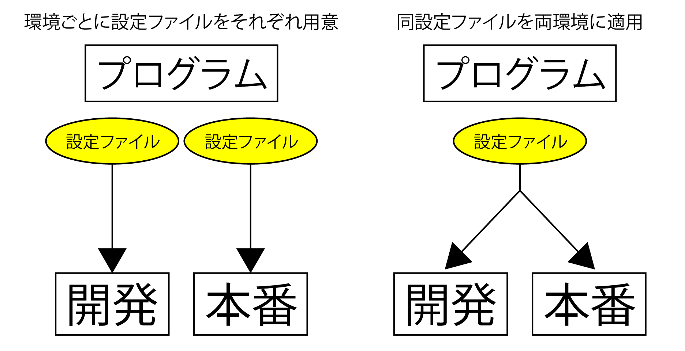

# 開発環境と本番環境

* このままではDBの設定ファイルは環境ごとに別のものを置く必要がある
* 環境によってプログラムで制御ができることが理想

* `.env`を複数用意
    * development
    * staging
    * production
* Apacheで設定した環境変数によって使用する.envをプログラムに選択させる
* しかし、Laravel5では.envを複数用意しても、読み込み不可
* Laravel5.4では、そもそも環境ごとに異なる.envを置くことを推奨

今回、設定は以下の手順で設定を行う

