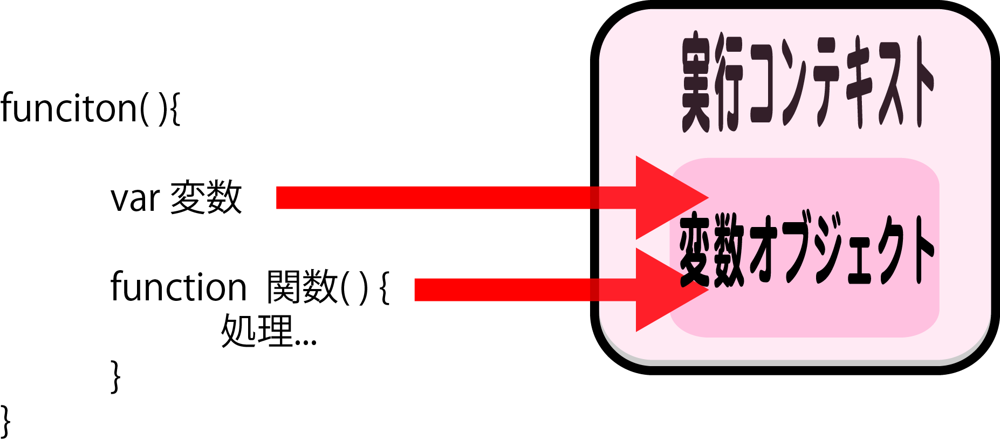
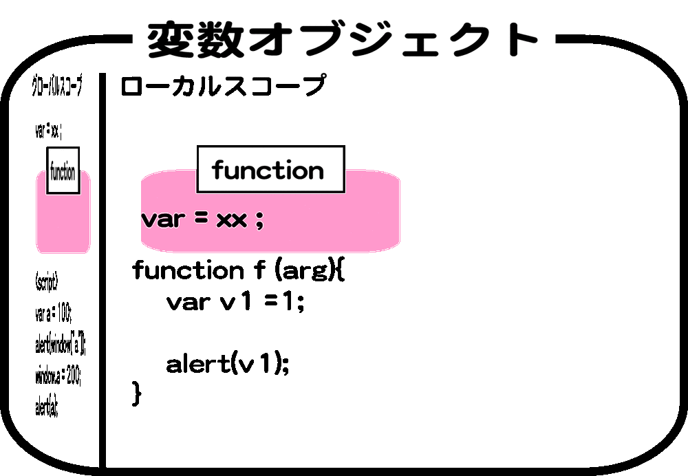

# 変数オブジェクト

* JSのオブジェクトはハッシュテーブルと同等
    * ハッシュテーブル: 連想配列

## 変数の宣言と参照

### 概要

* 変数の名前と値を格納したJSオブジェクトへの読み書き
* ハッシュテーブルへの読み書き
    * 変数名をキー、変数値を値とする

### 変数の宣言

* 値を識別子に対応付ける
    * 名前束縛 (Name binding) あるいは名前結合と呼ぶ
* 変数を宣言するとエントリがハッシュテーブル内に作られる
    * 変数名をキー、undefinedを値とする

### 値の代入

* 変数に値を代入すると、ハッシュテーブル内の値が書き換わる

### 変数の参照

* 変数名をキーとして値を取り出す
    * 値への参照: 値に束縛された識別子
* 実行コンテキストは、連想配列を持っている
    * 連想配列: 変数オブジェクト

### 関数内での変数の定義

* 関数内で定義する
* 全ての変数、関数は`変数オブジェクトのプロパティ`として追加される
    * すべての変数宣言について、変数オブジェクトに対応するプロパティを追加する
* ソースコードで変数がどのように初期化されるかにかかわらず、プロパティの初期値はundefinedになる
    * 変数が定義済みプロパティ（つまり、仮引数か関数）と同じ識別子を使っている場合、上書きは行われない



### 関数に引数を渡す

```bash
vim Variable.js
```

```javascript
function aa(bb) {
    console.log(bb);
}
aa('仮引数');
```

```bash
node Variable.js #仮引数 と出力される
```

### プロパティの上書き

* 関数宣言が仮引数と同じ識別子を使っている場合
    * プロパティは上書きされる

```javascript
function aa(bb) {
    console.log(bb);
    function bb() {} //仮引数と同名の関数を宣言
}
aa('仮引数');
```

```bash
node Variable.js #[Function: bb] と出力される
```

# ホイスト

## グローバル変数を宣言

* 関数の中で宣言された変数が関数の先頭で宣言されたことにされる

```javascript
var globalVal = 'Global';
(function() {
    console.log(globalVal);
})();
```

```bash
node Variable.js #Global と出力される
```

## 関数内で宣言/代入

* 関数内でvar宣言をし、外側のグローバル変数が無効になる

```diff
  var globalVal = 'Global';
  (function() {
      console.log(globalVal); //Undefined
+     var globalVal = 'Local';
+     console.log(globalVal); //Local
  })();
```

## 変数を代入

* 宣言ではなく代入のみの場合には外側のグローバル変数が利用される

```diff
  console.log(globalVal); //Global
- var globalVal = 'Local';
+ globalVal = 'Local';
  console.log(globalVal); //Local
```

### アクティベーションオブジェクト

* 関数呼び出し時に作成される目に見えない変数オブジェクト
    * 実行コンテキストに結びついている
    * 関数宣言しただけではアクセス不可
    * 関数本体は、ローカル変数のようにargumentsオブジェクトにアクセス可能
* 変数オブジェクトは、アクティベーションオブジェクトのプロパティ


