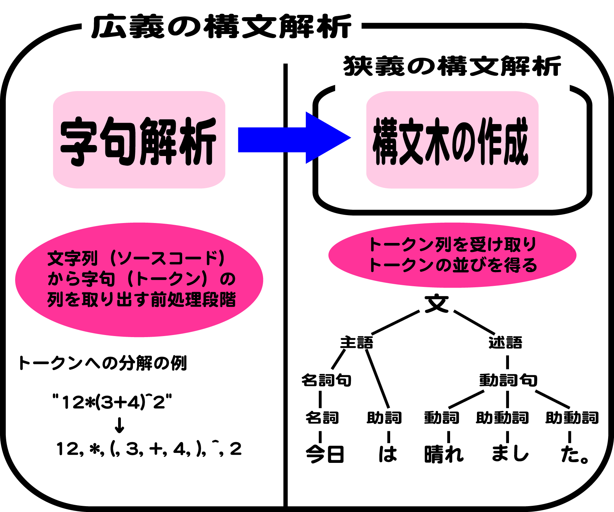

# 関数

* JSの関数はオブジェクト
* 自分自身のプロパティを持てる
* `関数宣言`をサポート
* `関数式`もサポート
    * つまり、`無名関数`もサポート
* スクリプトは、解釈中、全てトークン単位に分解されて処理される
    * トークン: ソースコードを構成する単語や記号の最小単位(終端記号)のこと

### 仮引数と実引数

* メソッドには好きなだけ実引数を渡すことが可能
    * JSは関数を呼び出すときに、引数の個数をチェックしない
    * 引数を渡さずに呼び出すことも可能
        * 実際の値が与えられなかった仮引数は、値がundefinedになる
* 仮引数は、関数に渡される実引数にアクセスするための方法が２つあるなかの１つ

## 関数の定義

### 関数宣言

* 関数を定義する方法の１つ
* `functionキーワード + 識別子 + 中かっこで囲まれた本体`
* 処理の本体に名前をつける
* 関数は値を返すことが可能
    * return文がない場合は、`undefined`を返す
    * 関数はオブジェクトなのでプロパティを持つことができる

```javascript
function assert(message, expr) {
    if (!expr){
        throw new Error(message);
    }
    assert.count++;
    return true;
}
assert.count = 0;
```



### 関数式

* 関数式を書くと、すぐに実行可能な無名関数が作られる

#### 無名関数

* 他の関数やオブジェクトメソッドへのインラインコールバックに使われる
    * インライン展開: 呼び出す側に呼び出される側のコードを展開する手法
        * これにより`関数への制御転送`をしないようにする
* 以下のことが可能
    * 他の関数に渡す
    * 関数の戻り値にする
    * 変数やオブジェクトプロパティに代入
* 関数式では、識別子はオプション
    * 名前付き関数式が無名かどうかは定義の問題
    * しかし、外側のスコープからは無名に変わりはない
* 関数式は、最後に終端子としてセミコロンを書くこと推奨

```javascript
var assert = function (message, expr) { //無名関数式
    if (!expr) {
        throw new Error(message, expr)
        {
        }
        assert.count++;
        return true;
    }
    assert.count = 0;
};
```

#### 無名関数で自分自身を参照する

* 無名関数には名前がないため、以下のいずれか使用して辿っていく
    * assert変数
    * スコープチェーンを介してアクセスできるargments.callee

#### 名前つき関数式の例

```javascript
var assert = function assert(message, expr) { //名前つき関数式
    if (!expr) {
        throw new Error(message);
    }
    assert.count++;
    return true;
};
assert.count = 0;
```

### Functionコンストラクタ

* 新しい関数の作成に使える
* 関数本体を動的にコンパイルする場合に役に立つ
* 関数はプロトタイプチェーンを持っている
* 関数は`Function.prototype`を継承する
    * また`Function.prototype`は`Object.prototype`を継承する
* Function.prototypeオブジェクトは、以下のプロパティを持つ
    * `call()`と`apply()`
    * `length`と`prototype`

#### length

* 関数が期待する仮引数の数を示す
    * 関数のarityとも呼ばれる
    * アリティ: 関数や演算が取る引数（オペランド）の個数を意味する用語

#### prototype

* 関数オブジェクト内部のプロトタイプ
    * すなわち、Function.prototypeへの参照ではない
* コンストラクタとして関数を使って作られたオブジェクトのプロトタイプとなるオブジェクト

```javascript
describe('FunctionTest', function () {
    it('test function length prototype', function () {
        expect(assert.length).toBe(2);
        // expect(document.getElementById.length).toBe(1);
        expect(console.log.length).toBe(0);
    });
});
```

#### Functionコンストラクタで関数を定義

* 関数として呼び出したFunctionコンストラクタでassert関数を定義する
* 仮引数の指定方法が複数ある
    * 1個の仮引数ごとに1個の文字列を渡すもの
        * `("message", "expr")`
    * 1個のカンマ区切りの文字列を渡すことも可能
        * `Function("p1,p2,p3", "p4" , body);`

```javascript
var assert = Function("message", "expr", //Functionを使った関数の作成
            "if (!expr) { throw new Error(messag); }" +
            "assert.count++; return true;");
assert.count = 0;
```

## 関数呼び出し

* 関数呼び出しの方法は2通り
    * かっこを使う直接的な呼び出し
    * Functionから継承した`call()`、`apply()`を使う間接的な呼び出し
* コンストラクタは、関数として形でも呼びだし可能
    * `Function(p1, p2, ・・・pn, body);`
* コンストラクタは、new式を使った形でも呼びだし可能
    * `new Function（p1, 2p, ・・・, pn, body);`
* どちらの式も、引数として、新関数が受け付けなければならない
* 任意の数の仮引数を取らず、関数本体も持たない無名関数が作られる

```javascript
//関数の直接呼出し
assert("Should be true", typeof assert == "function");     
```

### argumentsオブジェクト

* 関数のすべての実引数は、argumentsという配列風のオブジェクトから取得可能
* このオブジェクトはlengthプロパティと数値インデックスを持っている
    * lengthプロパティ: 受け取った引数の数を示す
    * 数値インデックス: 関数呼び出しに渡された実引数に対応する`0`から`length-1`まで
    
```javascript
function arguTest(){
document.write(arguments[0]);
}
arguTest("これは仮引数のテストです");
```

### オブジェクトを使った関数定義

* 仮引数ではなく、このオブジェクトを使ったassert関数
    * 注意点として、argumentsオブジェクトを使うとパフォーマンスが下がる
    * argumentsは仮引数では使用を避けた方がよい
    * このオブジェクトを参照しただけでオーバーヘッドがかかる
    * ブラウザはargumentsを使わないように関数を最適化している
    * argumentsオブジェクトは配列風だが、配列メソッドを提供していない
        * しかし、配列メソッドは使用可能
            * その場合、以下のものを活用する
            * `Array.prototype.*`とその`call()`、`apply()`

```javascript
function assert(message, expr) {
    if (arguments.length < 2) {
        throw new Error("Provide message and value to test");
    }
    if (!arguments[1]) {
        throw new Error(arguments[0]);
    }
    assert.count++;
    return true;
}
assert.count = 0;
```

#### 引数から配列を作る

* 関数に渡された第1引数以外のすべての引数から構成される配列を作る例

```javascript
//argumentsで配列メソッドを使う
function addToArray() {
    var targetArr = arguments[0];
    var add = Array.prototype.slice.call(arguments,1);
    return targetArr.concat(add);
}
```

#### 文字列への変換

* argumentsの数値インデックスは、識別子を数値にしているプロパティにすぎない
    * 配列の場合と同様
* JSでは、オブジェクトの識別子は必ず文字列に変換される
* プロパティは文字列識別子でアクセス可能

```diff
  //文字列によるプロパティへのアクセス
  function addToArray() {
-     var targetArr = arguments[0];
+     var targetArr = arguments["0"];
      var add = Array.prototype.slice.call(arguments, 1);
      return targetArr.concat(add);
  }
```

### 仮引数と実引数

* argumentsオブジェクトは、仮引数と動的な関係を維持している
* argumentsオブジェクトのプロパティを書き換える
    * 対応する仮引数も変更され、その逆も成り立つ
        * 仮引数の`b`に42をセットする
        * `arguments[1]`も同様に更新される
        * `arguments[0]`にこの値をセットする
        * `a`も同様に更新される
* この関数は、仮引数と実際に受け取った値の間にしかない

```javascript
//実引数の変更
describe('FormalParameterArgumentsTest', function () {
    it('test dynamic relationship', function () {
        function modify(a, b) {
            b = 42;
            arguments[0] = arguments[1];
            return a;
        }
        expect(modify(1, 2)).toBe(42);
    });
});
```

#### 第2引数の省略

* 関数呼び出しのときに第2引数が省略するとUndefinedになる例
    * bに値が渡されていない
    * bに値をセットしても、`arguments[1]`は更新されない
    * そこで、`arguments[1]`は、まだundefinedのまま
    * `argument[0]`もundefinedのまま
    * aは実際に値を受け取っている
        * 戻り値もundefinedになる
        * argumentsオブジェクトとまだつながっているため
* この関係はバグの原因になる場合もある
    * 関数の仮引数を書き換えるとき、
    * 特に仮引数とargumentsオブジェクトの両方を使う関数の場合
* 仮引数やargumentsに書き込みするよりも、新しい変数を定義すべき
        
```diff
- it('test dynamic relationship', function () {
+ it('指定されていない仮引数には動的マッピングがきかない', function () {
- expect(modify(1)).toBeUndefined();
+ assertUndefined(modify(1));
```

## スコープと実行コンテキスト

* JSには、グローバルスコープと関数スコープの2種類のスコープしかない

```javascript
//関数のスコープ
it('test scope', function () {
    function sum() {
        //評価値がUndefinedであることをチェック
        expect(i).toBeUndefined();
        // assertException( function () {
        //     assertUndefined(someVar);
        // }, "ReferenceError");
        var total = arguments[0];
        if (arguments.length > 1) {
            for (var i = 1, l = arguments.length; i < l; i++) {
                total += arguments[i];
            }
        }
        expect(i).toBe(5);
        return total;
    }
    sum(1, 2, 3, 4, 5);
});
```

* i変数は、forループのなかのvar文よりも手前でも参照されている

```javascript
document.write(i);

for(var i=0; i<1; i++){ // ブラウザにUndefinedと表示される
}

```

### Reference ErrorとUndefinedの違い

* 変数を定義していなければReferenceErrorなる
* 変数を参照する後でも定義をしていればUndefinedとなる

```javascript
document.write(c);
// Reference Errorと表示される

document.write(c);
var c = "test";
// Undefinedと表示される
```

* でたらめな変数にアクセスしようとしても失敗する
    * ReferenceErrorが投げられることに注意
* しかも、i変数は、forループの終了後もアクセスでき、値を持っている
* i変数は、forループの終了後もアクセスでき、値を持っている
* 複数のループを使うメソッドでは、i変数をループごとに再宣言するコードは誤り

```javascript
for(var i=0; i<10; i++){ // i = 1 2 3 ...10
    document.write(i + "<br>");
}
for( i; i>1; i--){ // i = 10 9 8 .. 2
    document.write(i + "<br>");
}
```

### 実行コンテキスト

* ECMAScript仕様は、JSコードが実行コンテキストのもとで動作すると規定している
* 実行コンテキストはJSのアクセス可能なエンティティではない
    * しかし、関数とクロージャの動作を理解するためには実行コンテキストの理解が必須
* 仕様は以下
    * ECMAScript実行可能コードに制御が渡されたら、制御は実行コンテキストに入る
    * アクティブな実行コンテキストは、論理的にスタックを形成する
    * このスタックのトップにある実行コンテキストは、実行中の実行コンテキスト

### 関数

* 厳密モードは、2つの仮引数が同じ識別子を使っていると、厳密モードではエラーが投げられる
* ES3では、複数の仮引数に対して同じ識別子を使った場合には、最後の仮引数だけが関数内で参照可能
    * argumentsを使う場合を除くこの場合はすべての仮引数を参照可能
* 以下は新しい動作とES3の動作を比較したもの

```javascript
//複数の仮引数に対して同じ識別子を使った場合
"test repeated identifiers in parameters": function() {
    //ES5厳密モードでは構文エラー
    function es3VsEs5(a, a, a) {
        "use strict";
        return a;
    }
    
    //ES3ではtrue
    assertEquals(6, es3VsEs5(2, 3, 6));
}
```