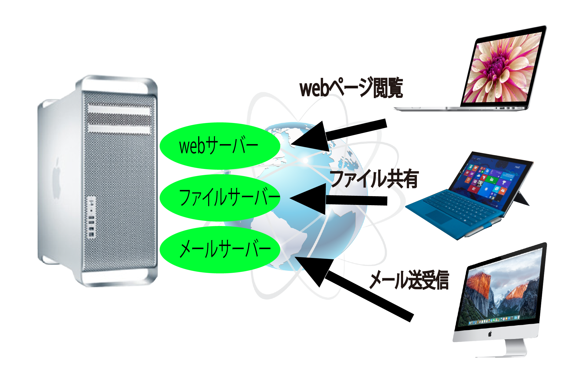
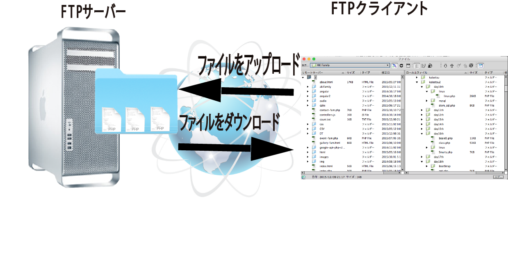
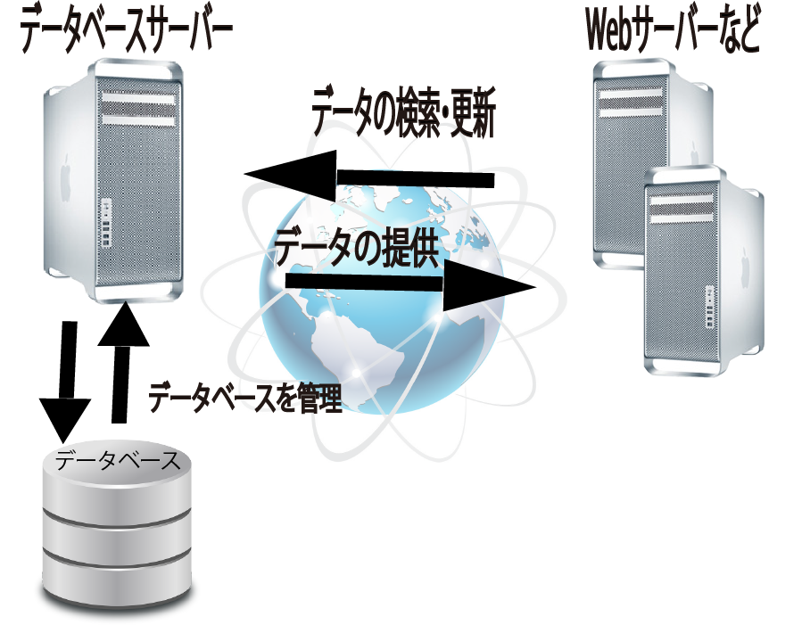
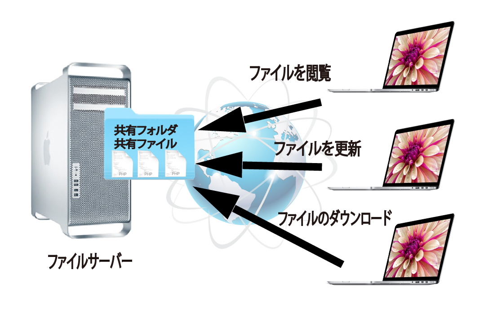
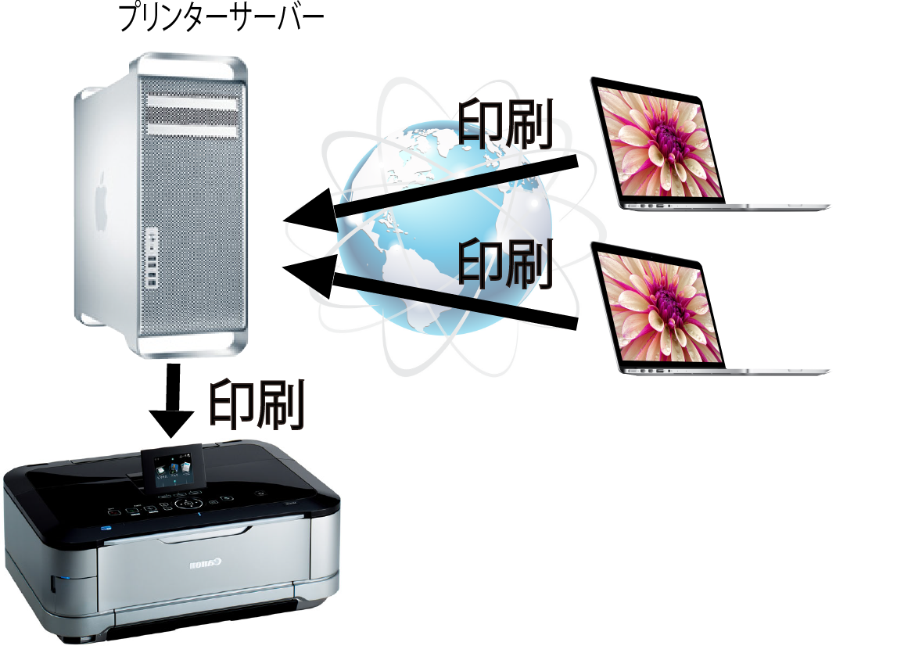
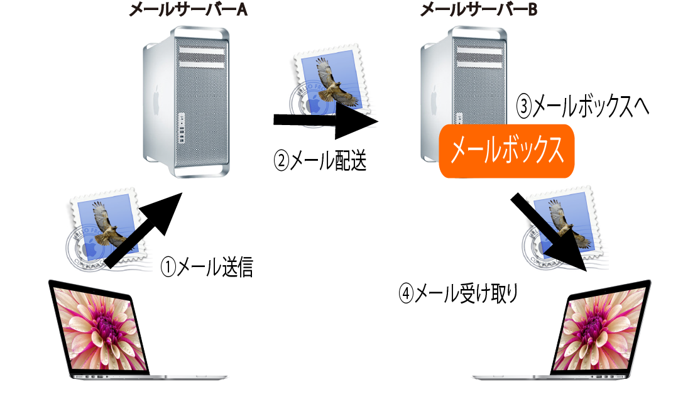
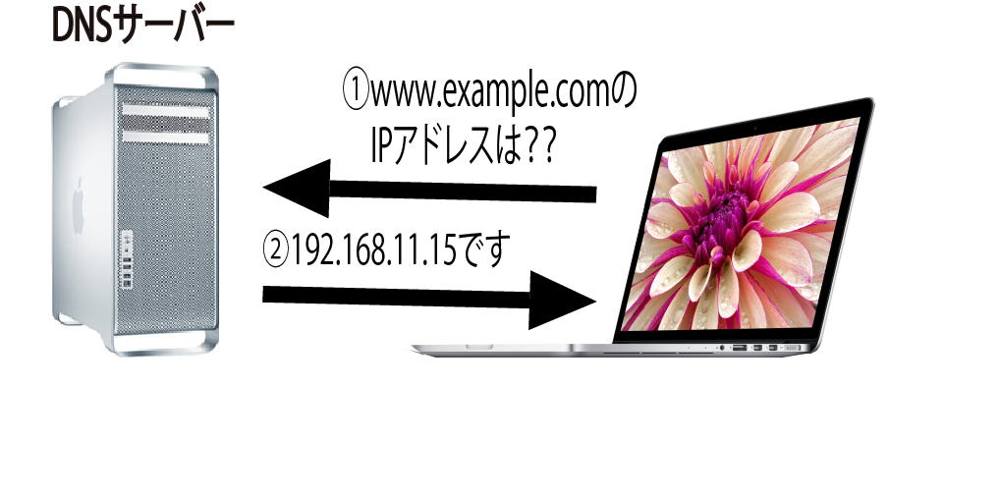
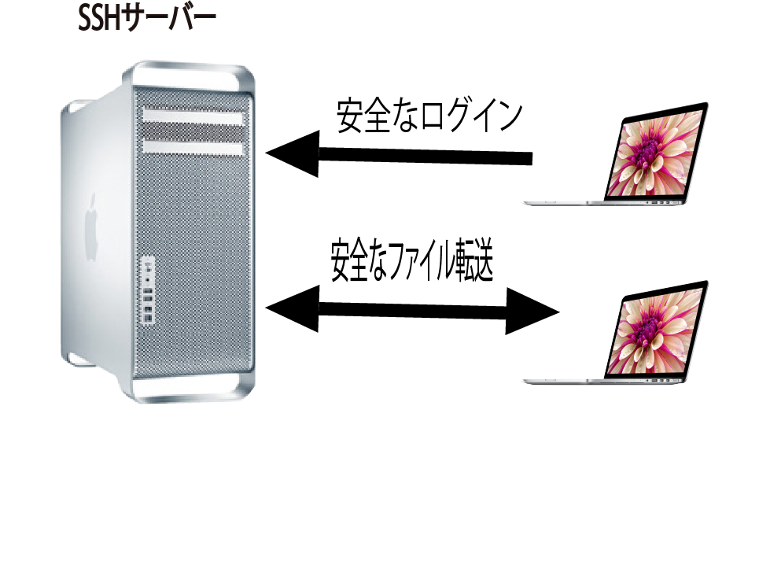
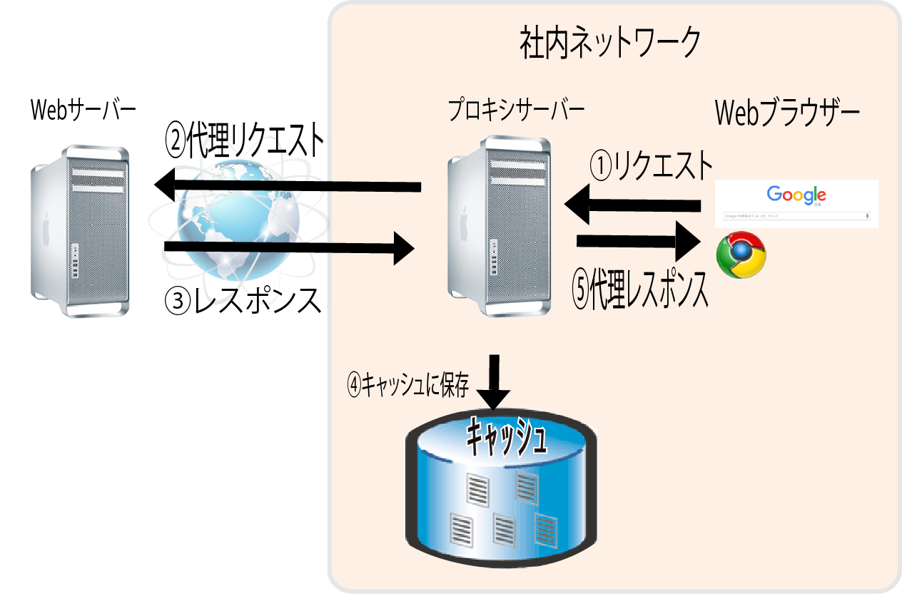

# Linux概要

## 主に４つの分野で採用されている

* サーバー分野
    * Linuxの使い道で最も一般的なのはサーバー用途
        * Webサーバー
        * メールサーバー
        * ファイルサーバー
        * DNSサーバー
        * データベースサーバー
        * メディアサーバーなど
* 組み込み分野
    * 家電製品や産業機器に組み込んで制御用に使用される
    * デジタル家電、パソコン周辺機器など
* デスクトップクライアント分野
    * デスクトップPCやノートPCに入れて、WindowsやMacOSの代わりにLinuxを利用するケースもある
* スーパーコンピューター
    * スーパーコンピューターのOSも、現在ではLinuxが主流

## 他のOSと比べたLinuxの強み

* コストが安い
* 内部がすべてオープンで透明性が高い
* 古いPCにも対応可能
* 多数のアプリケーション・ソフトウェアがある

## サーバーとは

* 現在では、コンピューターの利用は、ネットワークでの接続を前提としている場合が大半
* ネットワークで繋がれたコンピューター同士は、対等の立場で処理をするものもあれば、一方が他方にサービスを提供するものもある
    * 代表的なものが、クライアント/サーバーと呼ばれるモデル
        * サーバー: サービスを提供する側
        * クライアント: サービスを利用する側

* サーバーとなるコンピューターは、クライアントとなるコンピューターになんらかのサービスを提供する
    * この場合のサービスというのは下記のような情報処理のこと
        * 求めに応じて情報を提供
        * 依頼された情報を検索
        * ファイルを預かる
        * メールを受け取って送り届けるetc
* サーバーとなるコンピューターでは、ネットワーク経由でクライアントからの求めがあると、サービス処理を実施し、結果をクライアントに送り返す
* サーバーがコンピュターのハードウェアを表すのでない
* 「サーバー」「クライアント」という言葉は、あくまで「役割」や「立場」を表す言葉

## 代表的なサーバ

### Webサーバー

* Webページの集まり(Webサイト)を管理しリクエストを受けたWebページのデータをクライアントに送るサービスを提供
* Webサーバーを利用するクライアントをWebブラウザーと呼ぶ

### FTPサーバー

* ネットワーク経由でファイルを転送するサービスを提供する
* FTPはネットワーク経由でファイルを転送する際の細々した決まりごとを定めた規約
    * FTP: File Transfer Protocol(ファイル転送プロトコル)
    

### データベースサーバー

* DB管理ソフトウェアによってデータベースが管理されているサーバー
    * DBを管理・運用するソフトウェアをDB管理システム(DBMS:Database Manegement System)と呼ぶ

### ファイルサーバー

* ネットワーク経由でファイルを共有できるようにするサーバー
    * ネットワーク経由で扱える外付けハードディスクもファイルサーバー

### プリンターサーバー

* ネットワークを経由して１台のプリンターを大勢で使えるようにするサーバ

### メールサーバー

* 郵便物は、各地の中央郵便局を経由して宛先に送り届けられる
* メールの配送において、中央郵便局と似たような役割を果たしているのがメールサーバー
* パソコンやスマートフォンから送信されたメールを受け取り、適切なメールサーバーに配送する
* 届いたメールは利用者ごとのメールボックスに入り、受け取り側は、メールサーバーBのメールボックスからメールを取り出して受け取る

* Webブラウザーやスマートフォンのアプリから直接メールを操作できるようになっているが、それはWebサーバーやアプリからメールサーバーを利用している

### DNSサーバー

* IPアドレスとホスト名を相互に変換(`名前解決`)するサーバー
    * ホスト名: www.example.com」のような、わかりやすい名前
* DNSサーバーに問い合わせると、ホスト名に対応するIPアドレスを教えてもらえる

### SSHサーバー

* 安全なリモートログインを実現するのがSSHサーバー

### プロキシサーバー

* インターネット上のWebサーバーへ、クライアントのWebブラウザーのかわりに代理で接続するサーバー

