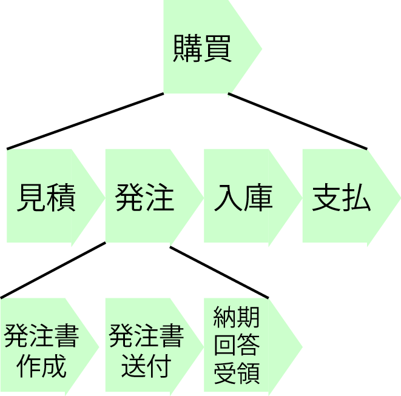

# 入れ子

* 大きな成果を出すためには相応の量の活動が必要

## 概要

* トップダウンの発想によるネスト
    * 大きな仕事を小分けにしていく
* ボトムアップの発想によるネスト
    * 複数の細かい仕事をひとまとまりにグルーピング
    
## 仕事と実装の類似点

* 予約管理システムを作るというプロジェクト
    * それ自体が1つの巨大な仕事
    * 当然ながら一発で成果を出せるわけではない
        * 仕事を小分けに（ブレイクダウン）して段取りを踏んで進めていく
* プログラム
    * 1つの処理が長くなったらサブルーチンや別メソッドに処理を切り出す

