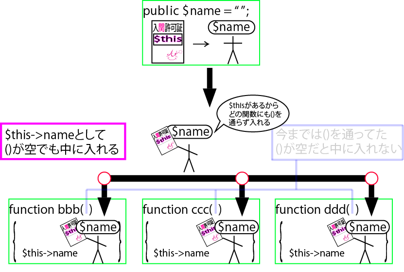
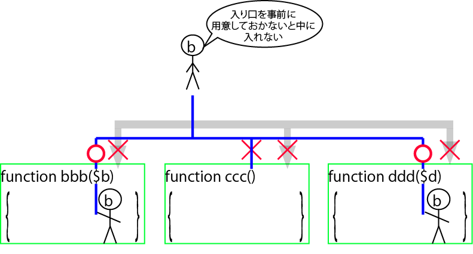
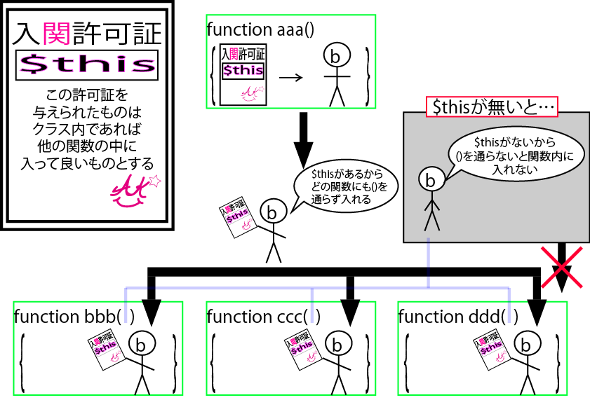
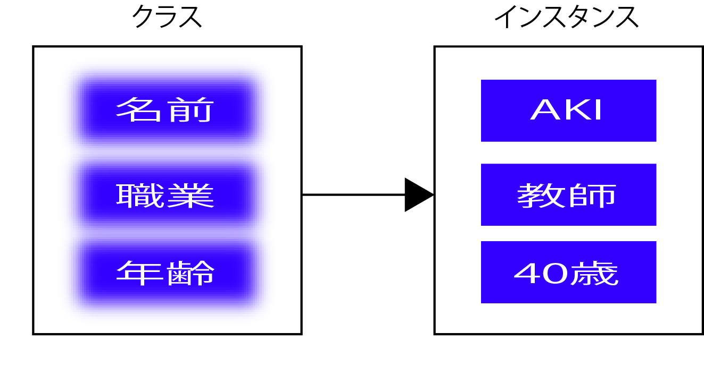
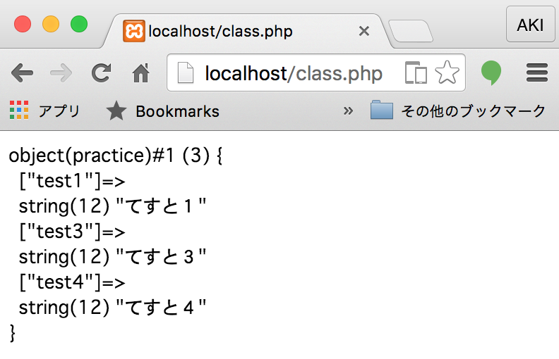
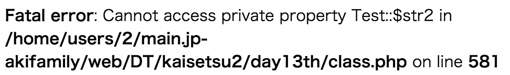

# オブジェクト・クラス

## オブジェクト指向の意味

### 処理と関数

* PHPによるプログラミングは、１つのファイルにたくさんの処理を記述しがち
    * ページ中心にコードを記述できるため
    * 小さなプログラムのうちはそれでも支障ない
    * ページ数が多くなると、同じ処理をコピーしてあちこちに記述することになる
    * コピーした箇所を変更することになるとコピー箇所全てを修正が必要
* PHPではfunction文を使って関数を作成することでこのような処理をまとめて部品のように使用可能

### オブジェクト指向の必要性

* さらにページ数が増え、関数も多くなり、大規模になると関数の名前のつけ方に困る
* 各関数共通の変数(データ)の持ち回しも大変
* オブジェクト指向で組み立てる
    * オブジェクト指向では、大規模なシステムをオブジェクトで分割する
    * オブジェクトは`処理`と`データ`がセットになったもの
    * カプセル化や情報隠蔽により、保守性の高いコードを記述可能

## クラスと抽象化

### クラスとは

* 同じような`オブジェクト`をひとまとめにして`抽象化`(名前をつけた)したもの
* オブジェクト指向でプログラミングする際、この`クラス`を使って記述する

### クラスの内部

* クラスの内部には`処理`と`データ`を定義
* オブジェクト指向では、処理のことを`メソッド`、内部のデータのことをメンバーと呼ぶ

### クラスの書き方

* PHPのクラス定義は、`classキーワード + クラス名`
* クラス名にはPHPの予約語以外の名前を使用可能
* 次に`{}`の間に`メンバー`や`メソッド`を定義
    * メンバーは変数で、メソッドは関数と同じ
* PHPでは、メンバーやメソッドは`public`、`private`、`protected`などの定義する

```php
class クラス名
{
    public $変数 = "文字列";

    public function 関数名()
    {
        // 処理を記述
     }
}
```

* クラス`User`を作成
    * クラス`User`では、メンバー変数`$name`をpublicで宣言
    * 文字列を格納して、`print_hello()`も同じくpublicで宣言
* メソッドの中でメンバー変数にアクセスするには、`$this`を使用
* $thisはインスタンス自身のことを表し`$this->name`とすることで変数の内容を参照可能
    * このときnameの前に`$`がないことに注意

```php
class User
{
    public $name = "名前";

    public function print_hello()
    {
        echo $this->name;
        echo "さん、こんにちは!!<br>";
    }
}
```

* メソッドの引数に何も指定されていないにも関わらず、メソッド内でメンバ変数が実行てきている

今までの書き方

```php
$name = "名前";

function print_hello($name)
{
    echo $name;
    echo "さん、こんにちは!!<br>";
}
```



* 関数の外の変数が関数の中に入るには入り口を用意しなければ関数の中に入れない
* また、外に出るときも同じで、関数の中で定義した変数は関数の外に出るにはreturn文が必要



* しかし、クラス内部で変数に$thisという許可証を与えると関数の内外を自由に出入り可能
* 関数内部で定義した変数が、関数の外でも利用でき、return文も不要



```php
<?php
$class_practice = new practice();

class practice
{
    public function __construct()
    {
        $this->aaa();  //②
        echo $this->b; //③
    }
    public function aaa() //①
    {
        $this->b = "aaa()で定義した変数b";
    }
}
```

* `aaa()で定義した変数b`と表示される
* return文を使用して返り値を受け取っていない
    * `aaa()`で定義した変数bが呼出せている
    * コンストラクは`new`キーワードで`このクラスを使います！`と宣言すると同時に実行される特殊なメソッド
* 通常はメソッド定義とメソッド実行箇所があるが`__construct`には実行箇所らしいところがない
    * `new practice()`の時点で実行されている

```php
<?php
$class_practice = new practice();

class practice
{
    public function __construct()
    {
        $this->aaa();    //②
        echo $this->b;    //③
        $this->bbb();    //⑤
    }

    public function aaa() //①
    {
        $this->b = "aaa()で定義した変数b";
    }

    public function bbb() //④
    {
        echo $this->b;
    }
}
```

### クラス内の定数

* クラスの中でも、値を変更できない`定数`を定義可能
* define関数の代わりに`const 定数名 = 値;`のようにする
* クラス内で参照する場合は、`self::定数名`とする

```php
<?php
class Member
{
    const AdultAge = 20;

    function printAdultAge(){
        echo self::AdultAge;
    }
}
```

## インスタンスの生成

### 実体化

* オブジェクトを抽象化したものがクラス
* クラスを実際に利用して処理を行うには、実体化してインスタンス(例という意味がある)を生成



* 例: 会員データを扱うクラスが名前や職業、年齢をメンバーとして持っている場合
    * 実際に利用するには、クラスを実体化(コピー)してインスタンスを作成
        * クラスそのものはそれらを定義しているテンプレート(型紙)のようなもの
    * 例えば、`名前：◯◯、職業：会社員、年齢：30歳`のように、実際に扱うデータをもたせる
    * 違った名前や職業、年齢をもたせることで、一つのクラスから複数のインスタンスを生成可能

### newキーワード

* クラスを実行する
    * オブジェクトを抽象化したクラスに対して、`new`キーワードを使ってインスタンスを作成
* 作成されたオブジェクトは、オブジェクト変数に格納される
* クラスに定義されているメソッドにアクセスするためには、このオブジェクト変数を利用する

```php
オブジェクト変数 = new クラス();
```

* インスタンスを作成する場所はクラスの前でも後ろでも構わない
* $userにはクラス`User`のインスタンスを格納するために、newキーワードを`User()`の前に記述
    * Userの`()`はつけなくても動作する
* インスタンスを作成時に引数を渡したい場合、この`()`の中に指定する

```php
$user = new User();

class User
{
    // クラス内処理
}
```

### よりみち

* ちなみにJSの場合、関数をnewキーワードで呼び出し可能
* 以下ではtypeofで型を判別している
    * 関数をnewで呼び出した後は`型が変換されている`ことに注意
    
```javascript
function abc(){
}

console.log(typeof.abc);    // function

var abc = new abc(); // ()を省略し、new abc;としてもエラーは表示されない

console.log(typeof.abc);    // object
```

* 変数の型はstringやintとなるが、２つ目の書き方ではオブジェクトとなる

```javascript
var aaa = "";

var abc = {
    init:"aa",
}

console.log(typeof(aaa));    //string
console.log(typeof(abc));    //object
```

* 以下関数を定義して変数に代入した形

```javascript
var ccc = function ccc(){};
```

* 正解は、functionとなる
* では、var abcをnewするとどのような結果になるか

```javascript
var abc = {
    init:"aa",
}

var abc = new abc;
```

* 結果は`Uncaught TypeError: abc is not a constructor`と表示される
    * `コンストラクタ』ではありません！`の意味
* つまり、newキーワードの後には`コンストラクタ`が続く
* functionステートメントの次の識別子(この場合はabc)がコンストラクタということになる
* JSとPHPでは感覚が違うので注意が必要
* １つのクラスは、１つのファイルに定義
    * ファイル名もクラス名と同じにすると、クラスを定義したファイルが一目でわかる
* 定義したファイルは通常のPHPファイルと同様にxxx.phpの形式で保存する
* 外部のクラスを使用するには、`include_once`などのPHPファイルを読み込むための関数を使用する

### クラスの開始終了タグ

* クラスを定義時に開始タグと終了タグを複数使うとエラーになることがある
* 以下のコードでは、クラス定義の途中にタグが含まれているため、エラーが表示され、動作しない

```php
<?php
$user = new User();
?>
<?php
    public $name = "美穂";

    public function print_hello()
    {
        echo $this->name;
    }
}
```

### オブジェクト変数



* クラスから生成されたインスタンスは`オブジェクト変数`に格納される
* この変数を使ってクラスの各メソッドにアクセス可能
* オブジェクト変数をvar_dumpすると図のような結果が得られる
    * `#1`というのは１つ目のオブジェクト変数ということ

#### オブジェクト変数の表示

```php
<?php
$class_practice = new practice();

echo "<pre>";
var_dump($class_practice);
echo "</pre>";

class practice
{
    public $test1 = "てすと１";
    public function __construct()
    {
        $test2 = "てすと２";
        $this->test3 = "てすと３";
        $this->aaa();
    }

    public function aaa()
    {
        $this->test4 = "てすと４";
    }
}
```

* また、クラスの中でさらにオブジェクト変数を作成している場合、以下のようになる

```php
object(BaseModel)#3 (1) {
  ["pdo"]=>
  object(PDO)#4 (0) {
  }
}
```

* 上記はBaseModelというクラスの内部で、PDOというクラスが呼び出されていることを表している
* この場合、オブジェクト変数PDOを呼び出す際には以下のようにする

```php
オブジェクト変数１->オブジェクト変数２
```

## カプセル化(情報隠蔽)

* オブジェクト指向の考え方では内部データ(メンバー変数)の変更はメソッドを使い行う
* このように、決められた手続き以外は内部データにアクセスできない仕組みを`カプセル化`と呼ぶ
    * または`情報隠蔽`と呼ぶ

## メソッド実行の構文

* メソッドを実行
    * オブジェクト変数に`->`をつける
    * クラス内部に定義されているメソッド名(ファンクション名)を指定する

```php
オブジェクト変数 -> メソッド();
```

## メソッドを実行する

* クラスのインスタンスを`$newuser`に格納
* クラスUser内部で定義した`print_hello()`を、`$newuser->print_hello()`のようにして実行する
* 実行されると、`$this->name`により、`$name`に格納された文字列が参照、表示される

```php
$newuser = new User();
$newuser->print_hello();

class User 
{
    public $name = '名前';
    public function print_hello() {
        echo $this->name;
        echo "さん、こんにちは！<br>";
    }
}
```

## アクセス制限のキーワード

### アクセスを制限する

* public、private、protectedをメンバーやメソッドに指定する
    * クラス外部から参照や実行を制限可能
* publicはクラス外部から参照可能
* privateはクラス内部からのみ参照可能
* protectedはクラス内部とそのクラスから`継承`されたクラスからのみ参照可能
    * 指定範囲外からメンバー変数やメソッドにアクセスするとエラーになり動作が止まる

| キーワード | 制限 |
|:----|:----|
| public | 外部から参照可能 |
| private | 変数を宣言したクラス内のみ参照可能 |
| protected | 変数を宣言したクラスと継承されたクラスから参照可能 |

### 外部からアクセスする

* 変数を２つ定義しただけのTestクラスを作成
* $str1はpublicで、$str2はprivateで宣言
* クラスを実行できるように$testにインスタンスを格納して、`$test->str1`として変数の値を参照

```php
// 実行するとエラーが表示される
class Test
{
    public  $str1 = '公開';
    private $str2 = '秘密';
}

$test = new Test();
echo $test->str1;
echo "<br>";
echo $test->str2;
echo "<br>";
```

* `$test->str1`では`公開`という文字を表示する
* privateで宣言した`$str2`を`test->str2`として参照する
* `Fatal Error: Cannot access private property`とエラーが表示される
* メンバー変数はこれらの宣言をしないとエラーになる



### メソッドを制限する

* メソッドもメンバーと同様に`public``private``protected`によりアクセス制限可能
* メンバー変数の場合は、必ずこの中のどれかを宣言しないとエラーになる
* メソッドの場合`public``private``protected`のうちどれも宣言されていない場合は、`public`として扱われる
* このため、`$test->TestPrivate()`として実行した処理だけエラーになる
    * 他の２つのメソッドは実行される

```php
class Test
{
    public function TestPublic()
    {
        echo "公開<br>";
    }

    function TestNothing()
    {
        echo "宣言なし<br>";
    }

    private function TestPrivate()
    {
        echo "秘密<br>";
    }
}

$test = new Test();
$test->TestPublic();
$test->TestNothing();
$test->TestPrivate();// この部分だけエラーになる
```
