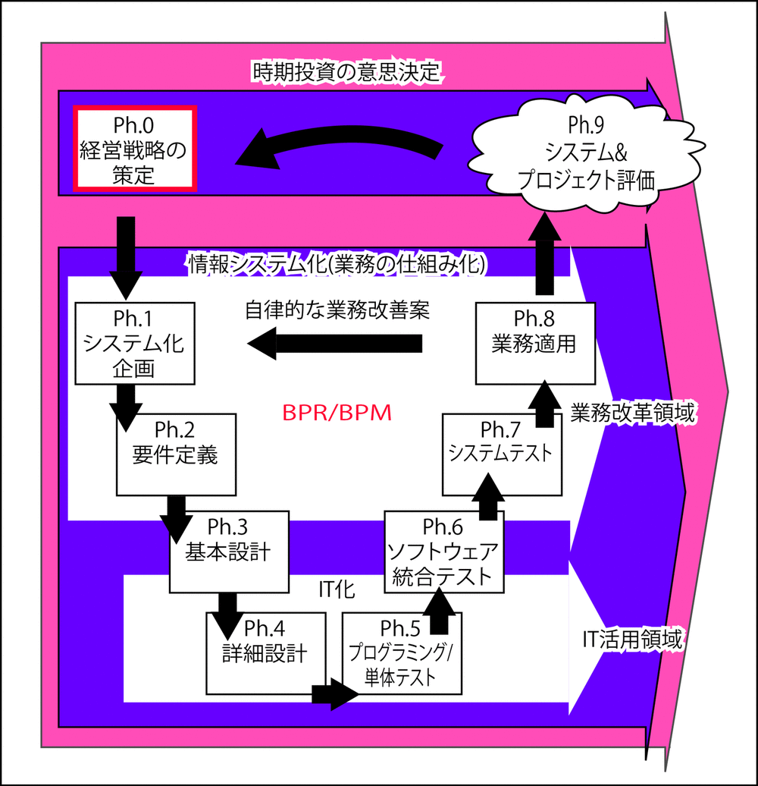
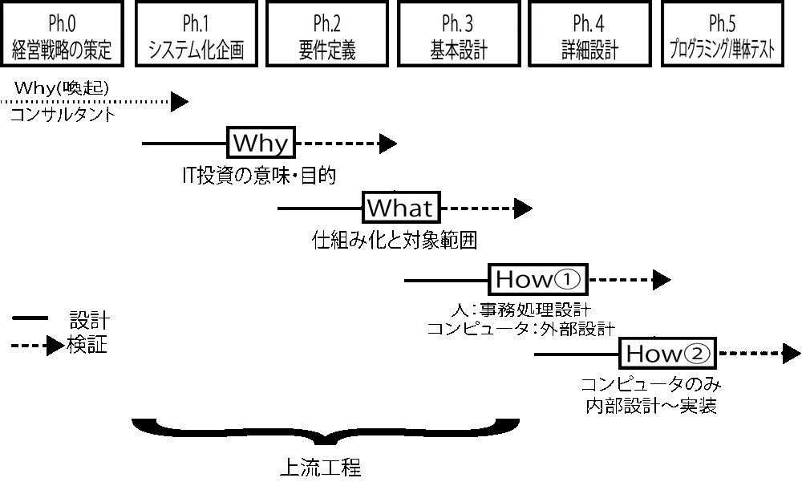
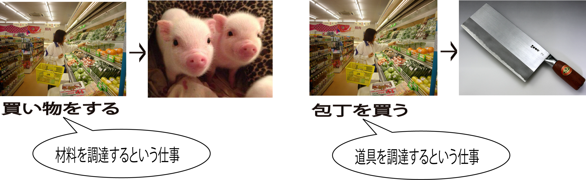
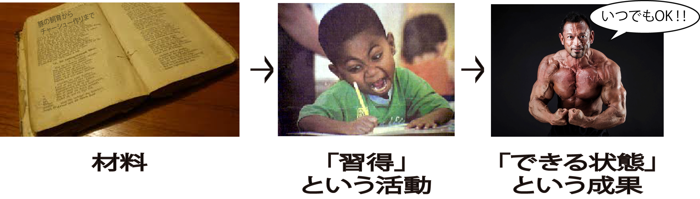

# ウォータフォール

* 漏れたものは作られない
* 図面の中で連鎖の中で必要な仕事が漏れる
    * ソフトウェアの要件が定義されない
    * その仕事で必要な道具だとしても
* そのためビジネスユースケースの存在は不可欠

## 基本

1つの仕事が成果を出すために、実は多くの仕事を必要とする

* 大まかな仕事の種類
    * 注文を作る
    * 材料や道具を調達する
    * 作業の手順を整える

## 注文を作る

* その仕事を行う為に必要なことを用意する
    * = 必要なものの一つとして`注文(依頼)`がある
    * `求められていない`ものは仕事ではない
    * `注文を作る`という仕事も当然必要
* 注文を作るという仕事があって後工程が機能する

## スキルアップも仕事

* `手順を習得する`も仕事のうち
* 手順書があるだけではうまく作業ができないこともある
    * 本来は手順書があれば誰でもできるのが理想

* Ph.1:システム化企画
    * 企業・組織の置かれた環境と戦略を理解し、新しい業務の仕組み全体の流れを描き出した
    * トピックとなるコンピュータの機能や、それを前提とした組織と責任の分担も見直した
    * その結果、`誰が`、`なぜ`、`どういう順序(いつ)で何をするか`、が決まった
    * すなわち新しい業務の仕組み(=ビジネスモデル)の骨格が決まった

## 次の工程への準備

* Ph.2:要件定義に着手する準備
    * 投資対効果分析や承認を得て、業務機能関連図を一段階具現化する
