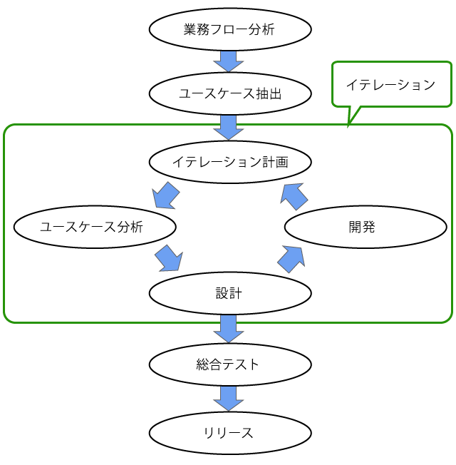

# スパイラルアプローチ

* オブジェクト指向開発ともいう

## 条件の例

* 中規模の開発
    * 業務フローの作成が1回で終わる程度
* リリースは最終のみ1回
    * イテレーションごとのテストは結合テスト程度
    * イテレーション単位で外部にリリースすることは考えていない
* 1つのイテレーションは4カ月程度
    * １つのイテレーション
        * ユースケース分折から開発完了までを行う
         *規模にもよるが、4カ月月程度はかかる
* イテレーションは3～4回程度
    * 1年くらいで3～4回のイテレーションを回す
        * 中規模システムで1つのイテレーションが4カ月程度の場合
* メンバーの多くはユースケース分析も開発も行えるスキルを持つ
    * ある程度スキルの高いメンバーにを揃える

## フロー

* 業務フロー分析
* ユースケース抽出
* イテレーション計画
* イテレーション開発
    * ユースケース分析
    * 要件定義
    * 設計
    * 開発
* 総合テスト
* リリース

## 業務フロー分析

* 業務フローを作成
    * ユースケースを抽出するため
* 企画を確認する
* 全体像を描く(ビジネスユースケース)

## ユースケース抽出

* システムユースケースを抽出
    * 業務フローから抽出することを想定
* 全体像を大まかに区分けする
* 実装技術を決める
* ソフトウェアで実現したいことを整理整頓

## イテレーション計画

* 抽出したユースケースからイテレーション計画を策定
    * ユースケースの数、依存関係、重要度をもとに優先度をつけて計画にする

## イテレーション開発

### ユースケース分析

* イテレーションに割り当てたユースケースに対してシナリオなどのユースケース記述を書く
    * ただし、外部仕様を検討するという意味で、設計の一部として行うこともある
* 利用者の行動シナリオを書く
* 概念データモデルを作る

### 要件定義

実装要件を確定する

* 決定したユースケース記述に対して、下記を実施
    * UIを決める
    * 扱うデータを決める
    * 機能を決める

### 設計

外部設計を含めた設計を行う

### 開発

設計に従って実装とテスト

* 開発の終了時
    * 顧客にイテレーション単位での部分リリースを行う

## 総合テスト

* 各イテレーションで開発したシステムを統合してテストする

## リリース

* リリース

