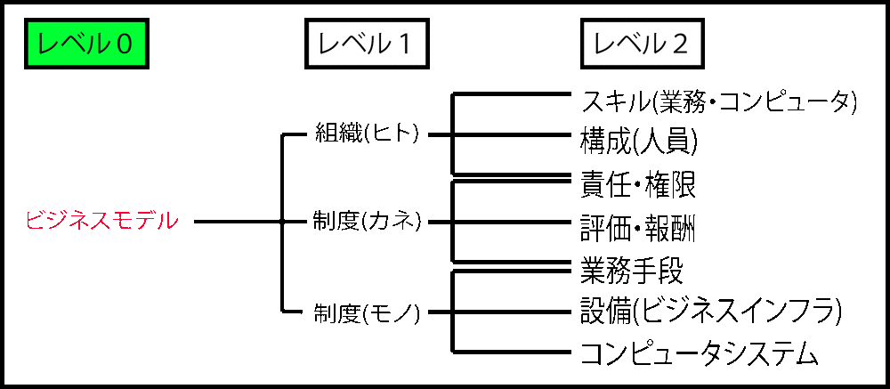

# ビジネスモデルと組織のリソース

## ビジネスモデル

次の全てを定義したもの

* 経営層の範囲
    * 市場
    * 提供するモノ・サービス
* コンサルやSEの範囲
    * 提供方法
    * 対価の回収方法
    * 仕組みの維持方法

## 組織のリソース

* 情報システム化プロジェクトでは主にレベル２を考慮
    * `コンピュータシステム`
    * `コンピュータ操作スキル`
    * `業務手順`

## ビジネスモデルの構成要素

* `ヒト・モノ・カネ`が中心
    * ph.1では構成要素全般を意識する

