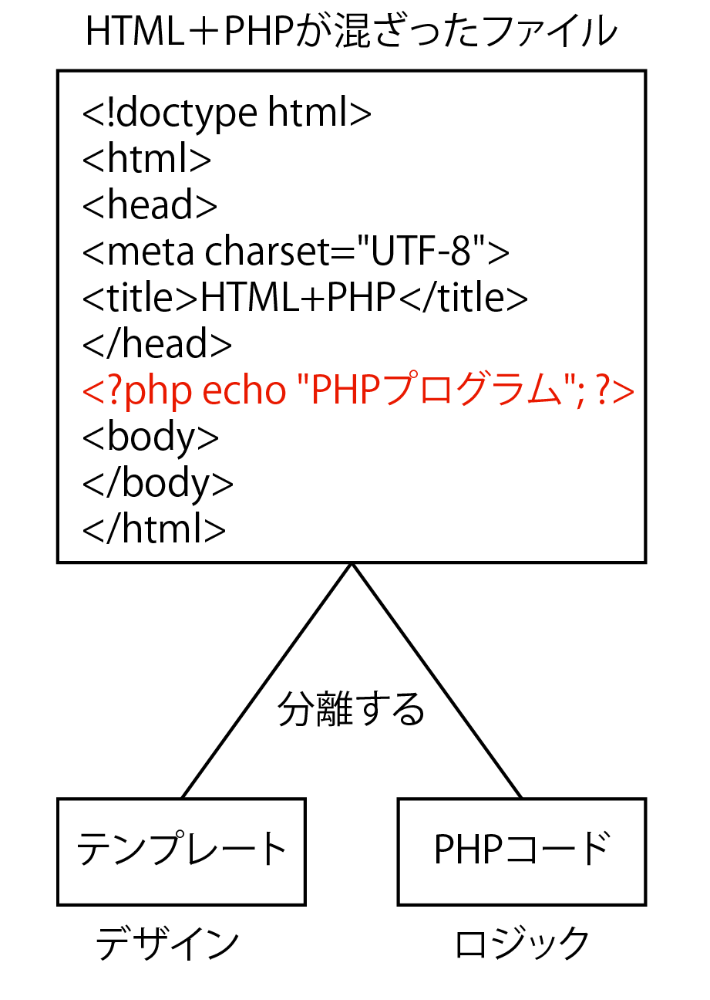
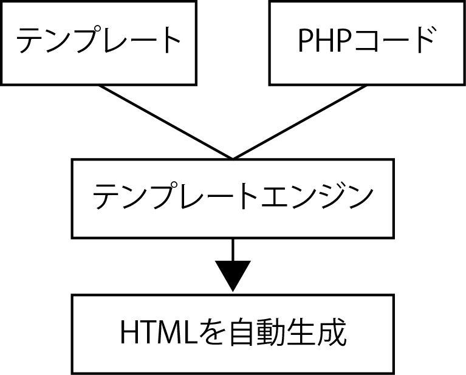

# Smarty

## テンプレートエンジン

### デザインとロジックの分離



* PHPの埋め込まれたHTMLのデザイン修正をする場合、PHPのスクリプト部分を理解してデザインする必要がある
* テンプレート(型紙)を使うことで機能を記述したロジック部分とデザイン部分を分離可能
* デザインはデザイナーが、PHPはプログラマーが担当をする場合に、互いに相手に影響せず自分の作業を進められる
* また、複数の画面が必要な処理でも１枚のテンプレートで済む

### テンプレートエンジンの仕組み



* テンプレートエンジン(またはテンプレートライブラリ)
    * HTMLと変数を定義したテンプレートファイルを解釈して、画面表示の処理を行うもの
* 変数の定義の仕方により、以下のようなものがある
    * PHP自体を利用する方法
    * HTMLのコメントタグを使用する方法
    * HTMLタグの属性部分を利用する方法
    * 専用のタグを使用するものなど
* Smartyは、専用のデリミタ`{}`を使用して変数の展開、ループなどの制御をテンプレートの中で行う

### Smartyの特徴

* Smartyは最初のアクセス時にテンプレートファイルを解釈してPHPとして実行可能なファイルとしてコンパイル(生成)する
* コンパイル結果はSmarty関連を収めたディレクトリの中の「templates_c」で確認可能
* このコンパイルは、次のアクセス時には行われない
* テンプレートファイルを解釈する処理が行われない分、次のアクセスから処理が早くなる
* テンプレートファイルが変更されると、直後のアクセス時に再度コンパイルが行われる

### コメントの書き方

```php
{* コメントを記入 *}

{*
複数行コメントはこんな書き方をする
*}
```

### if,elseif,elseの書き方

* {if}, {elseif}, {else}で、必ず{/if}とペアで利用する

```php
{if 条件}
{/if}
```

### foreachの使い方

```php
//PHPの場合
foreach ($arr as $key => $value) {

}

//これに相当するsmartyのforeachは
{foreach from=$arr key=key item=value}
{/foreach}
```

### 配列へのアクセス

```php
// $arr = ['abc' => 'def']の場合
// PHPの場合
$arr['abc'];

// smartyの場合
{$arr.abc}
```

### テンプレートでPHPの関数の利用

* `{php}{/php}`タグを利用することで、PHPの記述可能
* また、`|`を使って、PHP関数を適応可能

```php
// PHP
$price = 1.00;
$price = number_format($price, 0); // $price が 1 になる

// smarty
{$price|number_format:0}
```

## PHPと連携する

### Smartyクラスのインスタンス

```php
$smarty = new Smarty();
```

### テンプレートディレクトリの指定

* compile_dirは、smartyが自動生成するキャッシュファイルの保存先になるため、必ず指定が必要
* また権限を777の状態にしておく

```php
$smarty->template_dir = 'テンプレートディレクトリの指定';
$smarty->compile_dir = 'templates_cディレクトリの指定';
```

### assign()

* テンプレート内で利用する変数に値を割り当てる機能
* 初めの引数にはテンプレート内で表示するキー文字列を記述して、次の引数には、そのキーに割り当てる値を記述する

```php
$smarty->assign("title", "PHPのテスト");
```

### 配列の指定

* `assign()`は、テンプレート内の変数名とデータのセットを指定する
* 連想配列にこれら変数名とデータをセットにして指定も可能

```php
$smarty->assign(["name"=>"AKI", "ken"=>"東京"]);
```

### display()

* `assign()`を実行して変数の割り当てが終わると、表示処理を行う`display()`を実行する
* `display()`の引数には専用のデリミタを使用した変数を記述したテンプレートファイルを指定する
* テンプレートファイルの設置位置は`require_once`で指定してあるためファイル名を記述するだけ
    * `display()`が実行されるとテンプレートが表示される

```php
$file = 'login.tpl';
$smarty->display($file);
```

### テンプレートの記述

* `assign()`で「title」に「PHPのテスト」という値を割り当てる
* `assign()`で割り当てられたものと同じ変数名を、`{$変数名}`のように記述する
* 画面表示時にこの部分が割り当てられたデータに置き換えられて表示される

```php
//PHPファイル内
$smarty->assign("title", "PHPのテスト");

//テンプレート内
{$title}
```
