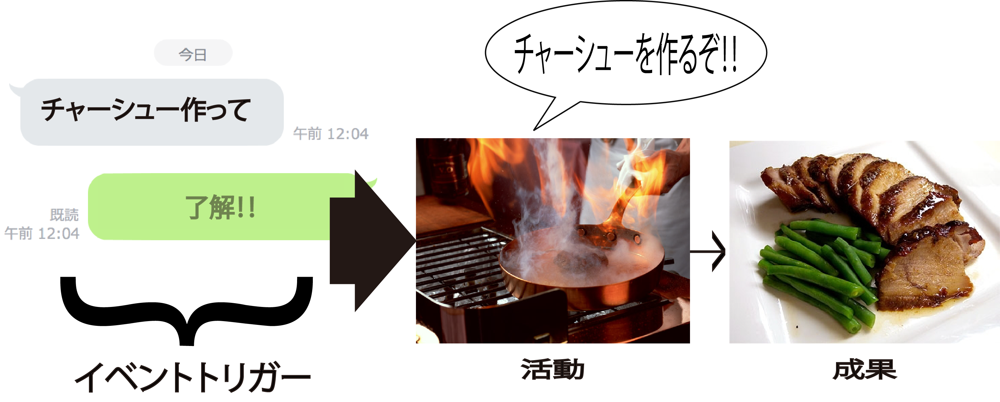
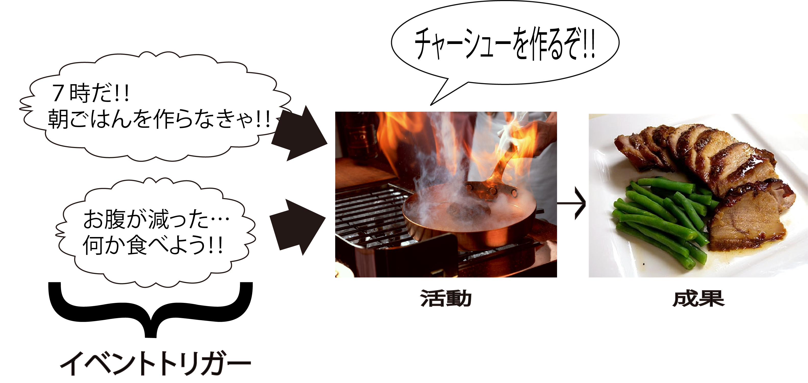

# 仕事の機会

* 仕事を行うタイミング
    * 他からのリクエストがあった時
    * ある条件を満たしたことにを検知したとき

## 他からのリクエスト

* 他人が、きっかけ（イベントトリガー）となる場合
    * チャーシュー作ってと依頼された場合
    * 注文を受けた時
    * 電話を受けた時
* 他からのリクエストを受け取ったことを検知したとき

## 条件を満たしたことを検知

* 自分の感覚
    * おなかが減ったと感じてチャーシューを作る
    * この商品欲しいと感じ購入する
* 時間など
    * 朝7時になったから朝食としてチャーシューを作る
    * トイレットペーパーの残りが1つになったからトイレットぺーパーを買いに行く

## ストアとDB

* 受け渡しの対象には、情報・データも含まれる
    * 例: `注文`というデータが顧客から渡される場合など
* 情報・データは電子メールだったりWebサイトからデータがDBに登録される
    * 直接人同士の間でやり取りされる訳ではない
* 適当なタイミングで受けとり側がピックアップして、手に入れる
    * メールボックスやDBという保管場所（ストア）を通じて、人同士が情報・データの受け渡しを実現

## 中抜きの実現

* ITの本質はプロセスイノベーション
    * 中抜きの実現
* ダイレクトに人同士を結ぶのではなく、ネットワークとDBというストアを組み合わせて、１クッション間に入れる
    * 受け渡しの跳躍を実現できる
* 余分な中間コストを排除してエンドツーエンドを実現するフォースする
    * 人も組織も仕事をすっ飛ばして、最終成果の受益者とスタート地点とを最短で直結させるにはどうすればよいかを考える
    * 情報の瞬間移動・跳躍という観点
* いかに成果をダイレクトに出せるかを考えながら業務設計をする
* そのために必要な仕事の連鎖としての行動シナリオを描く

