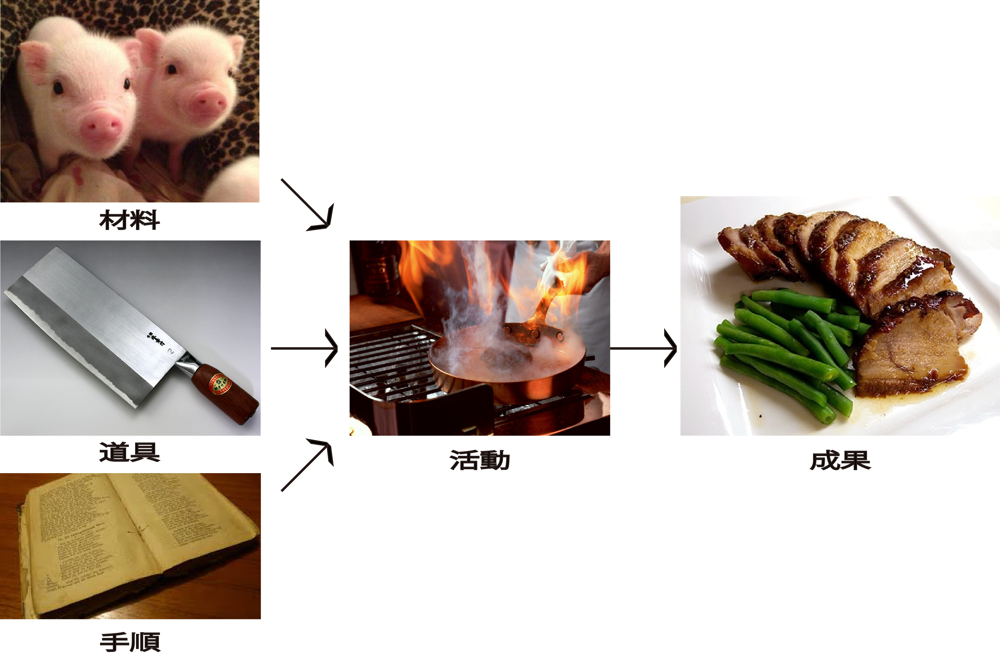

# 仕事の本質は「変換」

* 仕事は成果を出す
    * 成果は勝手に生じない
        * 例: チャーシューという成果を出す場合
        * 何にもない部屋で勝手にチャーシューが現われない

## 変換の条件

* [材料が必要](01)
* [道具が必要](02)
* [手順が必要](03)
* [機会が必要](04)

## 材料/道具/手順/機会で成果になる

成果には４項目すべて必要

* どれかが欠けても成果は出ない
    * リクエストがきても材料がなければ仕事はできない
        * 注文がきても商品がなければ出荷手配という仕事ができない
    * 手順が分からなければ他のすべてが揃っていても活動ができない
* この仕事を行うために必要なものをそろえるという仕事が別途必要

## 状態の変更

* 変換には`状態の変更`もある
    * 例: `検査をする`
    * 検査前と検査後では、材料も成果も客観的にはまったく変化がない
    * 検査するという活動の成果は属性
        * 検査済みの状態になっているものには`検査済み`の属性が付与される