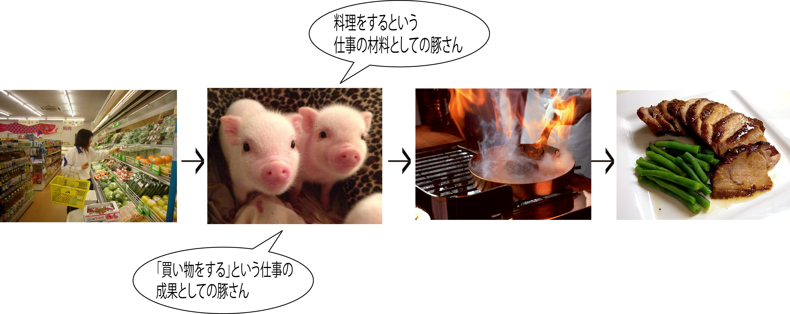
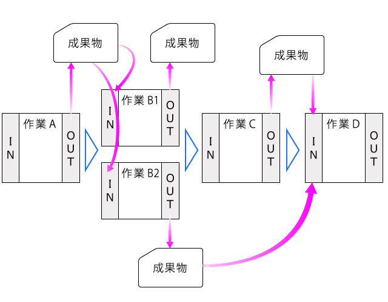

# 仕事の連鎖

* 仕事は1つで完結しない
    * ある仕事に必要なものも用意するための仕事というものが存在する
* その仕事の成果は、別の仕事をする際に必要なもの
    * その仕事を行う前の時点で成果を出していないと困る

## フロー

* 時系列の前後関係を整理すると、仕事は連鎖している
* この連鎖のことを`業務フロー`と呼ぶ
* その他、業務フローは以下の呼び方もされる
    * 工程
    * 段取り
    * プロセス
    * プロトコル
    * プロシージャなどと呼ぶ

## 仕事のプロセス

* 『仕事』は`材料`を元に`成果`を作成する
    * その成果物が次の実行単位業務の仕事の材料になる
* 仕事は成果を通して連鎖する

### 開発のプロセス

* 開発プロセスでも共通して、システム開発を行うには多数の作業(タスク)がある
    * それらの作業が順番に、あるいは並行して行われる
        * また、各作業には`入力(IN)`と`出力(OUT)`がある
* 出力である成果物は、その後の何か作業の入力になる

以下のことを意識して担当している工程に取り組む

* 実行する工程の入力になる前工程の成果物はどのようなものか
* その工程の期間と範囲はどこまでか
* 実行する工程の出力である成果物はどのようなものか

