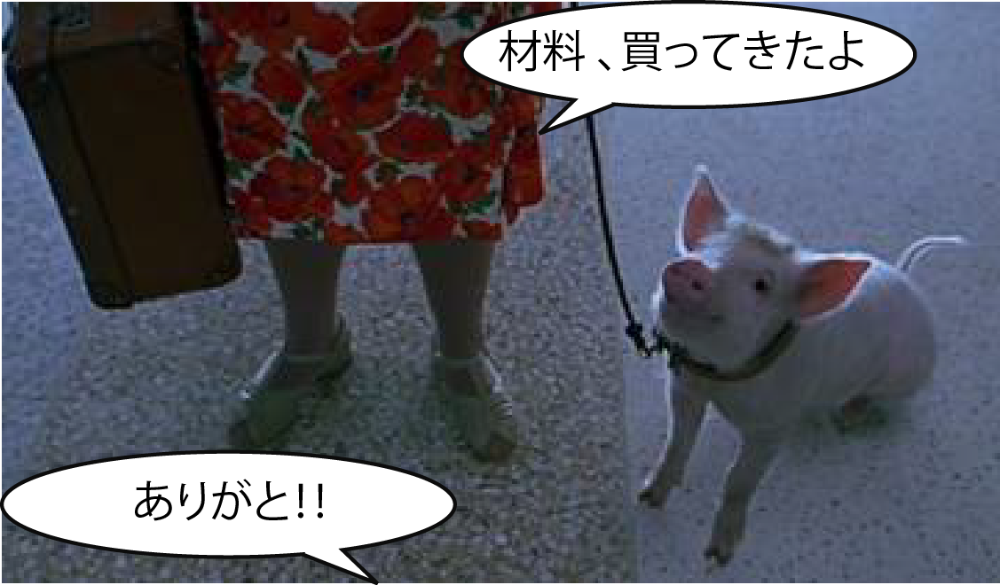
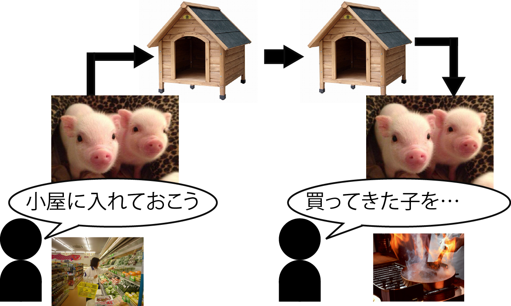

# 受け渡しと補完とピックアップ

* 仕事は勝手には連鎖しない
* やりっぱなしではだめ
* 成果を後工程につないでいくことが必要
* そこで発生するのが`受け渡し`という作業

## 受け渡し

* 受け渡しを実現する方法
    * 直接やり取りするケース
    * ストアしピックアップするケース
        * 前工程の側がどこかに成果物を保管(ストア)
        * 別のタイミングで後工程がそれをピックアップする

## 直接やり取りするケース

## ストアしピックアップするケース

### ストアの図示

* 保管場所は独立して存在する
    * 倉庫などのように人間やソフトとは独立
    * 保管場所も「保管するという仕事をする登場人物」と見立てる
    * 「保管場所と受け渡しをする」と表現可能
