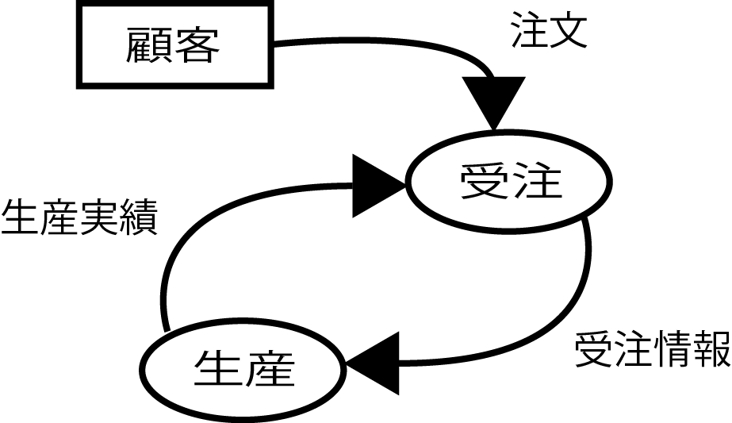
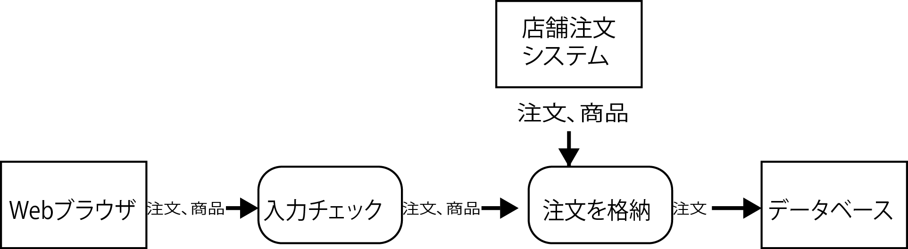

# DFD

* Data Flow Diagram
* 構造化設計手法による最も基本的なプロセスの記述
    * ○印はアクティビティ
    * 矢印はデータの流れ
        * ストアは使用しない
* IFとDBの間の処理を記述可能
    * IF: インターフェース
* 記述の自由度は高い
* 図面として表現能力は低い
           

* 生産と受注は、受注情報と生産実績というデータを相互にやりとり

## 特徴

* 処理間にデータを記述すること
    * これにより、処理の`入力と出力`が表現可能
    * 同じ処理を違う外部インターフェイスから呼び出し可能
        * 処理を共通化可能

## 構造化設計の欠点

* 仕様の変化に弱い
* 商品情報の価格の構造が変更された場合
    * 入力チェックの処理に影響が及ぶ
    * 注文を格納の処理に影響が及ぶ
* つまり、仕様変更が処理全体に影響してしまう
    * 図の入力チェック処理と注文を格納処理が関数の場合
        * 関数名や関数の引数と戻り値の方は変わらない
            * それぞれの処理の呼び出し方は変わらないことを意味する
            * これが`オブジェクト指向へのヒント`になる
        * 入力チェック処理と注文を格納処理の実装が変わる

## 方向性がない

DFDでは`プロセスモデルに方向性を持たせる`ことが考慮されていない
