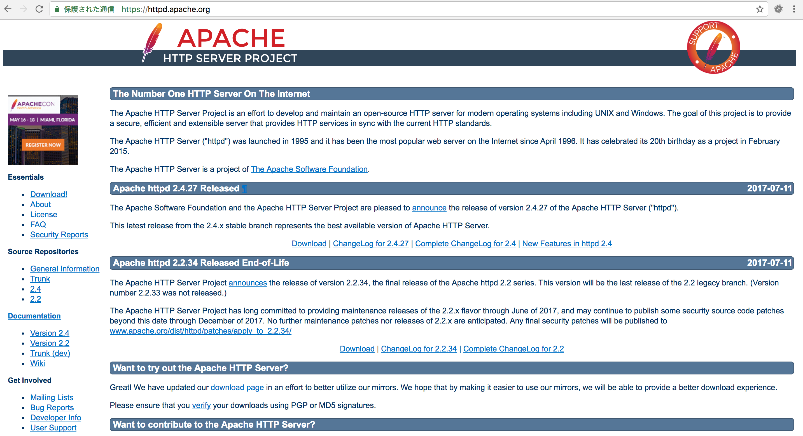

# Apache



* Apache HTTP Server
* Webサーバー・ソフトウェアとして広く使われている
    * Apache Project(アパッチプロジェクト)によって開発されている
    * Apache Projectは様々なオープンスオース・ソフトウェアを開発している
    * その中でもApache HTTP Serverが最も知られている
    * `Apache`と呼ばれることも多い
* Apacheはいくつかのバージョンに分かれる
    * 大きく分けて、2.0系、2.4系
* Cent OSでは`yum`でインストールできる
* パッケージ名は`httpd`
* ユーザー別のWebページを簡単に作成可能

## ソースパッケージ

* ソースパッケージ(ソース)が配布されている
    * RPMパッケージを配布していない

## 代表的な機能

* 静的なWebページの配信
    * 静的なWebページ: 変化のないWebページ
        * HTMLと画像のみで構成されたWebページなど
* 動的なWebページの配信
    * 動的なWebページ: ユーザーのアクションによって表示が変わるWebページ
        * 掲示板やECサイトなど
        * サーバー上で実行されているプログラムによって作り出される
* モジュール構成
    * モジュールを必要に応じて本体に組み込んで利用できる
    * Apacheは、様々な機能をモジュールとして分割している
    * 構成をシンプルにしつつ、色々な機能に対応可能
* SSL/TLS
    * `SSL` に対応している
        * Secure Socket Layer
    * `TLS` に対応している
        * Transport Layer Security
        * SSLを標準化した規格
    * 暗号化された安全な通信を提供する
* ユーザー認証
    * 特定のユーザーだけにWebページを公開可能
        * ユーザー名とパスワードを使用
* アクセス制御
    * 対象を絞ってアクセス拒否可能
        * 特定のホスト名やドメイン、IPアドレスからアクセス
* バーチャルホスト
    * １台のWebサーバーで、異なるドメインを持つ複数のWebサイトを運用可能


## 設定について

* Apacheの設定は、設定ファイルに記述されている
* `#` で始まる行はコメント行
* CentOS
    * メインの設定ファイルは`/etc/httpd/conf/httpd.conf`
    * /etc/httpd/conf/*
    * /etc/httpd/conf.modules.d/*
* Devian
    * RHL系で言うhttpd.confの内容は以下に分散される
    * /etc/apache2/apache2.conf
    * /etc/apache2/ports.conf
    * /etc/apache2/mods-available
    * /etc/apache2/sites-available

```text
cat /etc/apache2/apache2.conf 
# This is the main Apache server configuration file.  It contains the
# configuration directives that give the server its instructions.
# See http://httpd.apache.org/docs/2.4/ for detailed information about
# the directives and /usr/share/doc/apache2/README.Debian about Debian specific
# hints.
```

## 設定の書式

```text
ディレクティブ　設定値
```

* ディレクティブは設定項目名のこと
* 上の例では、ServerRootという設定項目に`/etc/httpd`という値を設定している
* ディレクティブと設定値の間はスペースで区切る

## httpd.confの主なディレクティブ

* ServerRoot
    * 設定等のトップディレクトリ
* Lister
    * サーバーが待ち受けるポート番号
* User
    * Apacheの実行ユーザー
* Group
    * Apacheの実行グループ
* ServerAdmin
    * サーバーの管理者
* ServerName
    * サーバー名
* DocumentRoot
    * ドキュメントルート
* DirectoryIndex
    * インデックスファイルの指定
* IncludeOptional
    * 外部の設定ファイル

### httpd.confの設定

ファイルパス: /opt/lampp/etc/httpd.conf

#### SeverRoot

* `ServerRoot` は設定ファイルやログファイルの起点となるディレクトリ
    * Apacheの設定ファイルなどが格納されているトップディレクトリを指定
    * httpd.conf内で相対パスで記述されている場合、ServerRootディレクトリから見た位置が記されている
    * 設定ファイル内で相対パスを指定すると、ここで指定したディレクトリからの相対パスとみなされる

```text
ServerRoot "/opt/lampp" # 31行目付近
```

#### Listen

* `Listen`には、Apacheが利用するポート(通信時の窓口)を指定
    * サーバーが待ち受けるポート番号を指定
    * 標準では80番を利用
        * Skypeなど他のアプリケーションを利用している場合はこのポート番号を変更する

```text
Listen 80 # 52行目付近
```

#### User、Group

* 子プロセスの実行ユーザーと実行グループを指定
    * 子プロセス: プロセスにより生み出されたプロセス
* Apacheのプロセスはサーバープロセスと子プロセスで構成される
    * プロセス: システム上で実際に動いているプログラムのことをという
        * サーバプロセス: クライアントからのリクエストを待ち受けるメインのプロセス
        * 子プロセス: クライアントのリクエストに対応する
* プログラムファイルは、apacheユーザーの権限でアクセスできる必要がある
* プログラムファイル: WebサイトのコンテンツとなるHTMLファイルや画像ファイルなど

```text
# 子プロセスをapacheユーザー、apacheグループとして実行
User apache
Group apache
```

#### SeverAdmin

* サーバーの管理者のメールアドレスを指定

```text
SeverAdmin root@localhost
```

#### LoadModule

* Apacheに組み込むモジュールをLoadModuleで設定
    * 行頭に「 # 」がついているモジュールは組み込まれない
    * `#` を外せばApacheに組み込める
        * XAMPPでインストールした場合は、`httpd-xampp.conf` 内でPHPをモジュールとして組み込んでいる
        * `httpd-xampp.conf` は、httpd.confのあるディレクトリの下の `extra` ディレクトリ内に設置してある

```text
LoadModule authn_file_module modules/mod_authn_file.so # 66 行目付近
```

#### ServerAdmin

* ServerAdminにはサーバ管理者のメールアドレスを設定
    * エラーが発生した時に表示される画面内に表示される
    
```text
ServerAdmin you@exmaple.com # 194行目付近
```

#### ServerName

* サーバの名前をSeverNameに設定
    * `サーバ名:ポート番号` のように設定できる
    * `サーバ名` だけでも構わない
    * サーバ名以外に `IPアドレス` の指定も可能
        * 実際に、公開するサーバは「ServerName www.xxxx.com」のように設定する
    * 設定を変更する場合は行頭の `#` を削除

```text
ServerName localhost # 205行目付近
```

#### DocumentRoot

* DocumentRoot(ドキュメントルート)には、公開コンテンツを設置するディレクトリ名を設定
    * ここに置いたindex.htmlファイルやindex.phpファイルはブラウザで確認できる
    * 画像やスタイルシート関連もこのディレクトリ以下に配置する

```text
DocumentRoot "/opt/lampp/htdocs" # 229行目付近
```

#### AllowOverride

* ApacheやPHPの設定をディレクトリごとに変更するために必要な `.htaccess`の有効・無効を設定できる
* 今回は.htaccessファイルを利用するため、AllowOverrideを確認
    * 設定値が `All` の場合は、`.htaccess`ファイルが有効となる
    * `None` にすると.htaccessファイルはApacheに読み込まれず無効となる
    * XAMPPではインストール時にAllに変更される

```text
DocumentRoot "/opt/lampp/htdocs" # 254行目付近
```

#### DirectoryIndexを設定する

* 記述した順番にサーバはファイルを探す
* URLでファイル名が指定されなかった時、インデックス(索引)ファイルとして返すファイルの名前を指定
    * 例えばサーバー名だけの場合やディレクトリまでしか指定されなかった時
* `http://www.example.com` のようにアクセスした場合、`index.php`が表示されるように設定する
    * 下記の設定の場合、`index.html` と `index.php` が同じディレクトリ内にあると、下記の順に探して表示する
        * `index.php`、「index.html」の順

```text
DirectoryIndex DirectoryIndex index.html. index html var index.php...省略 # 269行目付近
↓
DirectoryIndex index.php index.html
```

#### IncludeOptional

* httpd.conf以外の設定ファイルを読み込む
    * メインの設定ファイルhttpd.confに加えて、幾つかのサブ設定ファイルを使用
    * CentOSでは、/etc/thhpd/conf.dディレクトリ以下にサブ設定ファイルを配置する
    
```text
IncludeOptional conf.d/*.conf
```
