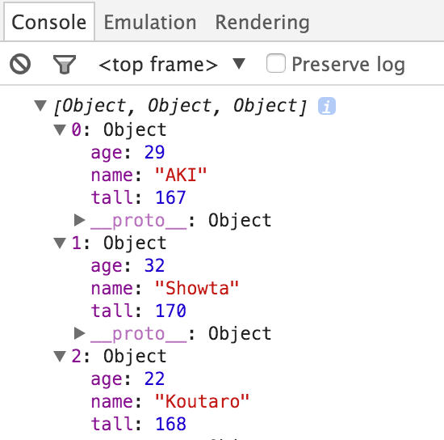

# Language

* [Javascript](javascript)
* [PHP](php)

## オブジェクト

* objectオブジェクト」というもののインスタンスを作成して、プロパティを追加する処理
* 無名オブジェクト(連想配列)の作成は非常によく使われるので、簡単に書くための文法が用意されている
* `{ }`の間に、プロパティ名と初期値をセットにしたものを、`,` (カンマ)」区切って列挙するだけ

```javascript
{
    プロパティ名:初期値, プロパティ名:初期値,・・・
}
```

* new演算子を使って同等の処理を書くと以下のようになる

```javascript
//「 var prod_data = { name:'iphone', price:'76800' }; 」と同等の処理

var prod_data = new Object();	//インスタンスの作成
prod_data.name = 'iphone';		//プロパティの追加
prod_data.price = 76800;		//プロパティの追加
```

* 例として一つ作成してみる

```javascript
{ name:'AKI', tall:167 }
```

* これで作成ができましたが、変数の中に入れなくては使用不可

```javascript
var data = { name:'AKI', tall:167 }
```

```javascript
console.log( data );

// 以下の結果が得られる
Object {name: "AKI", tall: 167}
name: "AKI"
tall: 167
__proto__: Object
```

## 出力する

* 匿名オブジェクトの中身(プロパティ)を出力するには以下のようにする

```javascript
document.write(data.name);
```

## 配列に格納する

* 次に、以下では３つの匿名オブジェクトを作成し、それを配列変数に記憶させる

```javascript
var data = [
{name:'AKI', tall:167}, //１つ目の無名オブジェクト
{name:'Showta', tall:170}, //２つ目の無名オブジェクト
{name:'Koutaro', tall:168} //３つ目の無名オブジェクト
];
```

* PHPの多次元配列と形式は似ている

```php
$data = [
    [
        'name' => 'AKI',
        'tall'=> 167
    ],
    [
        'name' => 'showta',
        'tall'=> 170
    ],
    [
        'name' => 'koutaro',
        'tall'=> 168
    ]
];
```

## 中身を確認する

```javascript
console.log(data);
```



* 以上のように、添え字付きで中身が参照できているのがわかる

## オブジェクトのプロパティにアクセスする

```javascript
document.write( data[0].name + '&lt;br&gt;' );
document.write( data[0].price + '歳&lt;br&gt;');
document.write( data[0].tall + 'センチ&lt;br&gt;');
```

* 無名オブジェクトは配列変数dataに記憶しているので、添え字を使ってアクセスする
* 無名オブジェクトのプロパティにアクセスするには、`.` (ドット)」に続けてプロパティ名を書く
* つまり、名前の後にカッコが付かなければプロパティ名、カッコが付けばメソッド名として扱われる

## プロパティと連想配列

* document.write()のようにドットで繋ぎ、以下のようにアクセスすることができたt

```javascript
//オブジェクトのプロパティにアクセス
オブジェクト.プロパティ
```

* しかし、JavaScriptでは、配列にアクセスするように`[]`を使ってプロパティにアクセスすることも可能

```javascript
var obj_data = {name:'AKI', tall:167};
document.write( obj_data['name']);
```

## しかし…！！

* 実は、連想配列に対して、プロパティと同じ書き方でアクセス可能

```javascript
var data = [];
arr['name'] = 'AKI';
arr['tall'] = 167;
document.write( data.name );
```

* つまり、プロパティと連想配列は、書き方が違うだけで同じもの
* しかし、無名オブジェクトと配列変数は同じものではない

## オブジェクトと配列

* 配列変数の正体は`Arrayオブジェクト`
* Stringオブジェクトのように、配列変数の実体は`Arrayオブジェクトのインスタンス`
* つまり、配列を操作するための便利なプロパティやメソッドを持っている

### プロパティ/メソッド一覧

* lengthプロパティ
    * 配列の要素数を返す
* popメソッド
    * 配列から最後の要素を取り除き、その要素を返す
* pushメソッド
    * 配列の最後に１つ以上の要素を追加し、新しい配列の長さを返します。',
* reverseメソッド
    * 要素の順番をギャ雨天させ、最初の要素を最後に、最後の要素を最初にします。',
* shiftメソッド
    * 最初の要素を取り除き、その要素を返します。',
* sortメソッド
    * 要素を並べ替えます。',
* spliceメソッド
    * 要素を挿入・削除します。第一引数に操作する要素の添字、第二引数に削除する要素の数を指定します。第三引数以降に挿入したい要素を記述します。',
* unshiftメソッド
    * 配列の最初に１つ以上の要素を追加し、新しい配列の長さを返します。',
* concatメソッド
    * 他の配列や値を連結してできた新しい配列を返します。',
* joinメソッド
    * 配列のすべての要素をつないだテキストを返します。',
* sliceメソッド
    * 配列の一部を取り出して新しい配列として返します。',
* indexOfメソッド
    * 指定された値を検索し、最初に見つかった要素の添え字を返します。見つからない場合は、-1を返します。',
* lastIndexOfメソッド
    * 指定した値を末尾から検索し、最初に見つかった要素の添え字を返します。',
* filterメソッド
    * 引数に指定したフィルタリング関数によって要素をチェックし、条件を満たす要素だけで構成された新しい配列を返します。'

これらのメソッドは無名オブジェクトにはない

* `配列変数 = 無名オブジェクト + 配列用の便利なメソッド`と考えるとわかりやすい

## for in文

* 「for in文」を利用すると、オブジェクトのプロパティ名を列挙可能
* 他の繰り返し文と異なり、繰り返し条件がない
    * カッコ内に「変数名in配列変数名」と書くと、順番にプロパティ名を代入して、ブロック内の処理を実行する
    
```javascript
for (var v in obj_data) {
    document.write( v + ' : ');
    document.write(obj_data[v]);
}
```

```javascript
var obj_data = {name:'チェア', price:400};

for(var v in obj_data){
    document.write( v + ' : ' );
    document.write(obj_data[v] + '<br>');
}
```

* なお、プログラム内で追加したプロパティはfor in文で列挙できるが、オブジェクトが最初から持っているプロパティには列挙できないものがある

## まとめ

* オブジェクトはメソッドとプロパティを持つ
* データの記録に無名オブジェクトを利用すると、同じものに対するデータを管理しやすくなる
* {プロパティ名:初期値, プロパティ名:初期値・・・}と書くと、無名オブジェクトを作成可能