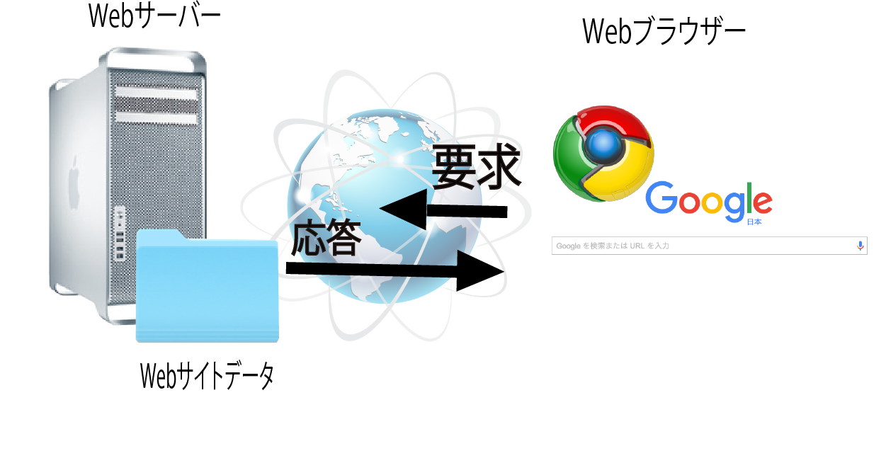

# PHPの概要

## PHPとは

* Personal Home Pageがその由来
* 正式名称は「PHP : Hypertext Proseccer
* 動的な画面を作るのが得意
    * Webで利用されるHTMLのようなハイパーテキストを閲覧者の操作によって生成
* 会員制システムや通販システムなどのWebアプリケーションを開発する状況でよく利用される言語の一つ

## 利用者側から見た特徴

* 無償
* 習得しやすい
* デバッグしやすい
    * エラー内容と行番号がブラウザ上に表示される
* マルチプラットフォーム
    * Linux、Windows、Mac OS X で動作する
    * AmazonのAWS SDK for PHPなど、クラウド環境にも対応

## 技術的な特徴

* サーバサイド・スクリプト言語
    * Webサーバ上で動作するための言語
    * ブラウザから送信されたリクエストに応じて処理を実行
    * 結果をHTML形式に整形してブラウザへ送信
* セッション管理可能
    * 通販システムや会員制のシステムなどを簡単に構築可能
* 各種データベースのサポート
* PDF、Ming、XML、JSONなどのサポート
* オブジェクト指向の強化
    * SPL(クラスライブラリ)を利用できる
    * トレイトが導入された
        * コードを再利用するための仕組み

## 動作に必要な仕組み</h3>

### Webサーバとの連携

* Webブラウザでホームページを閲覧するとき、WebサーバとWebブラウザの間では見えないところで各種情報をやり取りしている
* この情報はHTTPヘッダーという部分に書かれている



## PHPの動作を確認

### ApacheとPHPの動作確認

* 以下のコードを入力し、ファイルをhtdocs/配下に配置

```php
<?php phpinfo(); ?>
```

* Apacheのhttpd.confでDocumentRootについて設定したt
* 設定の仕方が正しければ、以下のようになる

```text
DocumentRoot '/opt/lampp/htdocs"
```

### ブラウザで確認する

* ブラウザを起動して確認
* Apacheが起動しているサーバ上でブラウザを起動した場合
    * 「http://localhost/」にアクセスすることで確認可能
* PHPに関する情報が表示されたら成功です。

### XAMPPを停止する

* XAMPPを停止したい時はターミナルに以下を入力

```bash
/opt/lampp/lampp stop
```

* 作業が終わったらroot権限を抜ける
