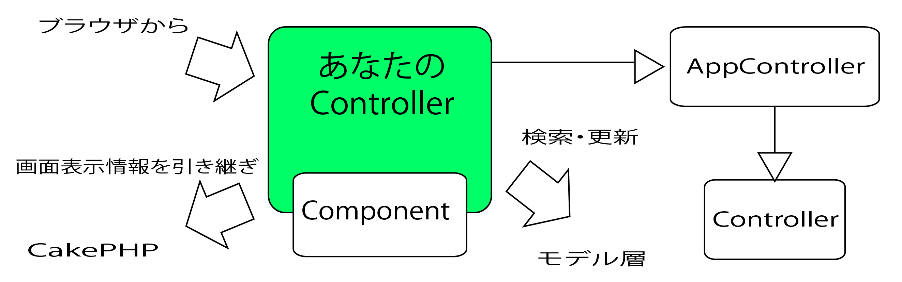
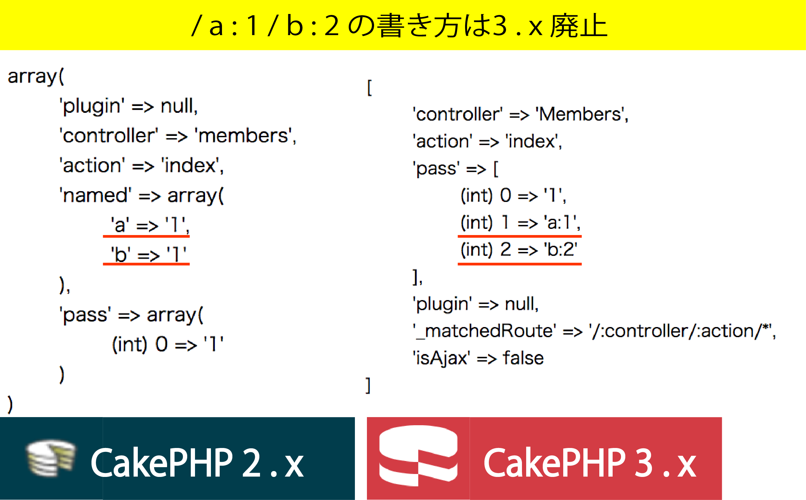

# CakePHP

## Controller

* コントローラは`AppController`クラスを継承
* `Controllerクラス`は`CakePHP`が提供するクラス
    * `コントローラ`の基底機能を備える
    


## Controllerクラスの主な機能

* ブラウザからのリクエストを受け取る機能
* セッションを管理する機能
* モデル・クラスを操作して、データを検索し更新する機能
* 画面に表示する情報をViewに引き継ぐ機能

## コントローラで行うこと

* モデルからデータを検索
* モデルのデータを更新
* 画面にデータを引き継ぐ
* リダイレクトする

## Component(コンポーネント)クラス

* Controllerクラスに`機能追加`するクラス
* `全モデル共通で使う処理`は`AppController`に書く
* `一部モデルで使用する処理`は`Conponent`を作る

## コントローラーとアクションの命名規約

* コントローラクラスの名前は`キャメルケース複数形`
* コントローラクラスのファイル名は`コントローラクラス名+(.php)`

## コントローラとURI

* 標準的なURI
    * `http://localhost/アプリケーションルートURI/コントローラ/アクション`

### コントローラ名が複数の単語が連なる場合

* 例: MailContentsController.php

```text
// cake2.x
/meeting_rooms/アクション
// cake3.x
/meeting-rooms/アクション    // 3.xの場合には - (ハイフン)で繋ぐ
```

## アクション

* ブラウザから送信されたリクエストを受け取る呼び出される
* アクションは機能一覧でいう`処理`に相当する
* コントローラ・クラス内の特定のURLにアクセスした時に呼び出されるメソッド

## レイアウトのON/OFF

### CakePHPの処理の流れ

* Webアプリケーションが実行される
* アクセスされたアドレスに対応するコントローラのインスタンスが自動的に作成される    
* そのインスタンスのメソッドが呼び出される形で処理が実行される

```text
$thisは、フレームワークによって生成されたインスタンスの中で処理を行う際に、
このコントローラー自身に用意されているメソッドなどを呼び出すために利用される
```

* autoRender
    * このautoRenderは、ページを自動的にレンダリングし、レイアウトする機能の設定

# Controllerクラスの基本形

```php
<?php
namespace App¥Controller;

use App¥Controller¥AppController;

class コントローラ名 exctends AppController //3.x
{
    ...ここにアクションメソッドを用意する...
}
```

# URLから値を渡す

## $this->request

* URLパラメータを使った値の受け渡しについて
    * ブラウザから送信されるHTTPリクエストは`$request`に格納される
* 仕様頻度が高いもの
    * `params`: `パラメータ`が格納される
    * `data`: `FORMデータ`が格納される

```diff
  public function index()
  {
-     $this->autoRender = false; //レンダリング機能を使わず、全てアクション内でページを作成する
-     echo "<html><head></head><body>";
-     echo "<h1>Hello</h1>";
-     echo "</body></html>";
+     debug($this->request);exit;
  }
```

```bash
open -a Google\ Chrome http://localhost/hellos/
```

```text
object(Cake\Http\ServerRequest) {
    trustProxy => false
    [protected] params => [
        'controller' => 'Hellos',
        'pass' => [],
        'action' => 'index',
        'plugin' => null,
        '_matchedRoute' => '/:controller',
        '_ext' => null,
        'isAjax' => false
    ]
```

### $requestに値を渡す

* アクション名の後に値を付ける
    * `params`にその要素ごとに配列形式で格納される
* 例: 以下は`$this->request`に`1`を渡す

```bash
open -a Google\ Chrome http://localhost/hellos/index/1
```

```diff
- 'pass' => [],
+ 'pass' => [
+     (int) 0 => '1'
```

## アクションへ受け渡す

* アクセスする`アドレス`を使い`値をアクションに受け渡す`
    * これは自動的にアクションに引き渡される
        * URIから渡した値をメソッド内で使用可能
        * GETとは別のもの
    * 渡された値を受け取るには引数を用意

```php
//パラメータを使った値の受け渡しの例
public function view($id)
{
    echo "渡された値は" . $id;exit;
}
```

```bash
open -a Google\ Chrome http://localhost/hellos/view/1
```

```text
渡された値は1
```

### 複数の値を渡す

```bash
open -a Google\ Chrome http://localhost/hellos/index/1/moji/でも/OK
```

```text
'pass' => [
    (int) 0 => '1',
    (int) 1 => 'moji',
    (int) 2 => 'でも',
    (int) 3 => 'OK'
],
```

## 複数の値を受け取る

* 対応する数だけ引数を用意
    * いくつでもリクエストから受け取れる
* ２つ受け取るようにコントローラを編集

```diff
- public function index()
+ public function index($a = '', $b = '')
  {
-     debug($this->request);exit;
+     if ($a != '') echo "パラメータA:" . $a;
+     if ($b != '') echo "パラメータB:" . $b;
+     exit;
  }
```

```bash
open -a Google\ Chrome http://localhost/hellos/index/1/2
```

```text
パラメータA:1パラメータB:2
```

* パラメータがない場合、これらの引数に値は渡されない
    * 普通に`http://localhost:8765/hellos/`でアクセスすると、`$a, $b`は空になる
    * そのため、引数に初期値を指定
        * 引数の値が空でなければ処理を行う

## クエリーパラメータ(GET)

* `クエリー文字列`を足す方式でもリクエストパラメータを引き継ぐことが可能
    * `id`というパラメータに`123`が、`nameパラメータ`に`AKI`が入る

```bash
open -a Google\ Chrome http://localhost/hellos/index?id=123&name=AKI
```

```text
[protected] query => [
    'id' => '123',
    'name' => 'AKI'
]
```

### 2.xと3.xのリクエスト・パラメータの差異

* CakePHPでは2.xまでは、/アクション/view/1/a:2/b:3と値を渡す方法があった
* これは3.xで滅んだ
    * 例: 下記のような文を追加する
        * ブラウザからlocalhost:8765/Members/view/1/a:1/b:2にアクセス
* 3.xからはこの形式のリクエスト・パラメータは`named`という配列の中に格納されない

```php
public function index () {
    debug( $this->request->params ); exit;
}
```



## コントローラからビューへ値を渡す

### 画面表示情報の連携

* `$this->set( 変数名, 値 );`
    * 第一引数: ビュー側で利用する変数名
    * 第二引数: その変数を代入する値
* View内での変数名は`ローワー・キャメルケース`が慣例
    * 先頭小文字のキャメルケース

## フォームの送信

* `POST`されたFORMデータは`CakeRequest::data`にセットされる
* `$this->request->data`には、`FROM内容`が格納される
* その値でDBを更新するのであれば、`data[モデル名][項目名] => 値`の書式
    * 独自に名前をつけて送信しても構わない

## リクエストのチェック

`is()`は、そのリクエストの種類をチェック

```php
$result = $this->request->is('post');
```

| 引数値 | チェックの内容 |
|:----|:----|
| 'get' | GETリクエストかどうか | 
| 'post' | POSTかどうか | 
| 'ssl' | https接続かどうか | 
| 'ajax' | Ajaxによるリクエストかどうか | 

# アクションの呼び出しとリダイレクト

* コントローラーのアクションを呼び出すには２つのやり方がある
    * `redirect()`
    * `setAction()`

## redirect()

* `$this->redirect( アドレス );`
* `HellosController`の`view`アクションにリダイレクト可能
* リダイレクトの場合表示されるアドレスも変わる
    * ブラウザ側で別アドレスに移動するため

## setAction()

* `$this->setAction( アクション名 );`
* CakePHPの内部で実行するアクションが変更されるようにする
    * 処理だけが別アクションに変更される
        * アドレスが変わらず見た目にはアクションが変更されない

### 簡単な利用例

* indexとerrの２つのアクションを用意
    * indexでは引数を１つ用意
        * パラメータがあった場合はその内容を表示し、
    * errアクション
        * もしパラメータがなければ実行される

```php
public function index($a='')
{
    if($a == '') {
        $this->setAction('err');        // アドレスを変えずに別メソッドを呼び出す
        return;
    }
    $this->autoRender = false;
    echo "パラメータ:" . $a;
}

public function err()
{
    $this->autoRender = false;
    echo "<p>パラメータがありませんでした。</p>";
}

```

### setAction()を使う場合の注意

* まだ何も出力されていない段階で実行する
* `setAction`のあとは`return`し、return後で処理を実行させない
    * これを怠ると、setActionしたアクションと、今のアクションが混じって出力される

# コントローラの共通処理

* 共通処理にまとめる

## 独自メソッド

```php
//独自メソッドの例
public function _aaa() // メソッド名は _ で始まること
{    
}
```

* メソッド自体は普通のクラスメソッドと同じ
* コントローラの場合は、必ずアンダースコア(_)から始まるメソッド名にする
    * そうでなければ、CakePHPはこのメソッドをアクションとみなす
    * ブラウザからアクセス可能になってしまう

## コールバックメソッド

* アクションが呼び出される前に呼び出されるメソッド
* このメソッドは、どのアクションの場合にも呼び出される
* 共通の処理をここに書くことで、毎回呼び出しロジックを記述する手間から解放される
    * 全てのアクションの中に共通メソッドの呼び出しを埋め込むのは手間
        * アクセスログの記録など
* `AppController::beforeFilter()`に実装すれば`システム全てのアクション実行前の処理`が実現可能
* コールバックメソッドには呼び出しのタイミングに応じて、４種類ある

```php
//コントローラのコールバックメソッド

//コントローラのアクションの前に呼び出される処理
public function beforeFilter()
    
// アクションの処理後、Viewに制御が渡る前に呼び出される処理
public fucntion beforeRender()
    
// リダイレクト時に呼び出される処理
public function beforeRedirect ($url, $status = null, $exit = true)

// アクション・ビュー処理後に呼び出される処理
// リダイレクト時には呼び出されない
public function afterFilter()
```

## コンポーネント

* 切り出しされた共通クラス
* 共通のメソッドへの切り出しをさらに一歩進める
    * `共通クラスへの切り出し`を行う
* 独自メソッドとして作った`_aaa()`を、コンポーネントに切り出してみる

```php
<?php
//自作のコンポーネント
/* app/ControllerComponent/MySpecialComponent.php */
class MyspecialComponent extends Component {
    
    // 共通処理
    public function aaa() {
        debug("Hello");    
    }
}
```

### コンポーネントのルール

* 独自のクラスを作って、そこに共通のメソッドを定義する
* コンポーネント作成の約束は以下
    * クラス名は`コンポーネント名 + Component`
    * ファイル名は`クラス名 + .php`
    * コンポーネント名は`キャメルケース`
    * コンポーネントクラスは`Componentクラス`を継承する

### コンポーネントの呼び出し

* **index() アクション**の中では、`コンポーネントクラス`の`new`もせずに呼び出すことができる

```php
class MeetingRoomsController extends AppController {
    //CakePHPではコントローラのインスタンス生成と初期化を自動的に行
    public $components = array("MySpqcial"); // コンポーネント名を定義
    
    public function index() {
        $this->MySpecial->aaa()    // メソッドaaa()の呼び出し
    }
}
```

# HtmlHelper

* フォーム生成機能

## ヘルパーの利用

* 画面生成の補助をする`ヘルパー`もPHPのクラス
    * `クラス・ファイル`を作っただけでは利用不可
        * その`Helperクラス`の利用宣言をする必要がある
    * `Component`は`Controller`で、`Behavior`は`Model`で、それぞれ利用宣言した
    * `Helper`も`Controller`で利用宣言する

## HtmlHelperを利用する

```php
//コントローラで$helpersにヘルパー・クラス名からHelperを除いた名称を代入
$helpers = array('Html');
```

```php
//画面ファイル内で以下のように利用
$tihs->Html->xxx();
```

## よく使用するヘルパー公式ページ

* [link()](https://book.cakephp.org/3.0/ja/views/helpers/html.html#id5)
* [css()](https://book.cakephp.org/3.0/ja/views/helpers/html.html#css)
* [script()](https://book.cakephp.org/3.0/ja/views/helpers/html.html#javascript)
* [image()](https://book.cakephp.org/3.0/ja/views/helpers/html.html#id4)

## ビューブロック

* 主に画面ファイルからレイアウト・ファイルの内容を制御するために使用する
    * 例: ビューブロック`my1`にタグ文字列をセット
    * レイアウト・ファイル内でビューブロックにセットした内容をそこに出力できる

```html
<head>
    <? echo $this->fetch('my1'); >
</head>
```

### ビューブロックにタグ文字列をセット

* 4つの方法がある

```php
// 出力したいタグ文字列の作成
$str = '<link rel="stylesheet" type="text/css" href="%s" />";
$tagStr = sprintf($str, Router::url('/css/my1'));

// 開始・終了を明示し、その間の出力をビューブロックとする
// (既存の同名ビューブロックの後に追加)
$this->start('my1'); // ビューブロック`my1`の作成開始
echo $tagStr;
$this->end();        // ビューブロックの作成終了

$this->append('my1', $tagStr);  // 文字列をビューブロックとする(既存の後に追加)
$this->prepend('my1', $tagStr); // 文字列をビューブロックとする(既存の前に追加)
$this->assign('my1', $tagStr);  // 文字列をビューブロックとする(既存の上書き)
```

