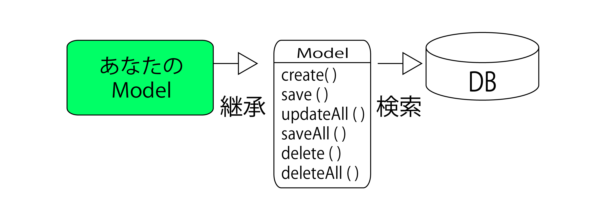
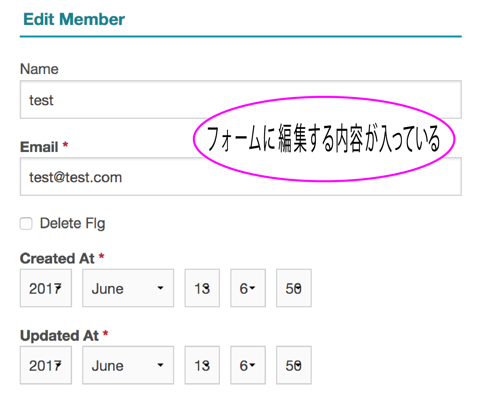

# 更新

* レコード作成(Read)のテンプレートを作る
* `add()`でフォームをテーブルに保存する
* 基本的にはデータの新規作成と大差はない
* エンティティを用意し、保存する
* ただし、新しいエンティティではなく、すでに保管されているエンティティを修正して保存する



## 新規作成との差異

* 新規作成
    * ただフォームを用意して送信したものを保存するだけ
* 更新の場合、まず`どのデータを編集するか？`をサーバーに伝える
    * サーバー側ではその情報をもとにエンティティを検索
    * その内容をフォームにセットした状態で、同意を得る必要がある



### 更新処理　create() ＆ save()

* 更新の前提条件
    * フォームにアクセスした時には、すでにどのデータを編集するのかわかっている
    * そのエンティティをフォームに設定した形で表示する必要がある
* 処理の流れ
    * ユーザーが編集するエンティティを指定してサーバーにアクセス
    * そのエンティティをデータベースから取り出し、フォームに設定して表示
    * ユーザーがフォームを編集して送信
    * 受け取ったフォームをもとに、サーバに保管されているエンティティを更新

## Templateの作成

* `Template`内の`Members`フォルダ内に、`edit.ctp`というファイルを作成
    * [edit.ctp](https://github.com/aki-creatist/CakePHP3/blob/develop/src/Template/Members/edit.ctp)
        * ここでは、フォームエディターを使ってフォームを作成している
        * 基本的にはadd.ctpと同じが、一箇所だけ異なる
    * `<?= $this->Form->create($member) ?>`
        * 最初に`<form>`タグを生成するところで、`create()`の引数に$memberを指定してある
        * この$memberは、コントローラー側で用意しておくもの
        * この中に編集するエンティティ(Membersインスタンス)が保管されている
        * フォームヘルパーのcreateは、`引数にエンティティのオブジェクトが渡されると、そのエンティティの値をもとにフォームを生成`する
        * つまり、エンティティ内のプロパティの値を、同名のフィールドに値として設定するようになっている
        * これにより、`$member`のエンティティの値が各入力フィールドに設定された状態で表示される

## 処理の作成

* コントローラー側にアクションを作成
* PersonsControllerクラスに、`edit()`を追加

```php
//src/Controllers/MembersController.php
public function edit($id = null)
{
    $member = $this->Members->get($id, [
        'contain' => ['Meetings']
    ]);
    if ($this->request->is(['patch', 'post', 'put'])) {
        $member = $this->Members->patchEntity($member, $this->request->getData());
        if ($this->Members->save($member)) {
            $this->Flash->success(__('The member has been saved.'));
            return $this->redirect(['action' => 'index']);
        }
        $this->Flash->error(__('The member could not be saved. Please, try again.'));
    }
    $meetings = $this->Members->Meetings->find('list', ['limit' => 200]);
    $this->set(compact('member', 'meetings'));
    $this->set('_serialize', ['member']);
}
```

* これで、編集するレコードのID番号を指定してeditにアクセスをする
    * 例: ID = 1番の編集するURL
        * http://localhost:8765/members/edit/1

これで、ID = 1のレコードの内容がフォームに表示された状態で現れるそのまま内容を書き換えて送信すると、そのレコードの内容が更新される

## 指定IDのエンティティの取得

* `$member = $this->Members->get($id);`
    * 引数で渡される`$idの番号のエンティティを取得し変数$member`に納める作業
    * モデルの`get()`を使用
        * このメソッドは、引数に指定したIDのエンティティを取り出すもの

### isでアクセス方法をチェックする

* requestの`is`を使い、アクセス方式をチェックして分岐する
    * isの引数に、`['post', 'put']`という配列を用意するのがポイント
* `if ($this->request->is('post'))`ではフォームヘルパーからエンティティの更新不可
    * POSTの他に、PUTというアクセスもチェックして処理を行わせるようにする必要がある

### フォームの内容をマージする

* 値が変更されたエンティティを作成
    * ifの値がtrueならば、フォームから送信された値をエンティティにマージする
    * getで取得したエンティティ(`$person`)と、フォーム送信されたデータ(`$this->request->data`)をマージする
    
```php
$member = $this->Members->patchEntity($member, $this->request->getData());
```

### save()

更新の場合も、登録のときと同様に、`save()`を呼び出する

### 画面にデータを引き継ぐ

モデル操作が終わったら、その情報を`View`(画面）に引き継ぐ

### エンティティを保存し、リダイレクトする

```php
if ($this->Persons->save($person)) {
    return $this->redirect(['action' => 'index']);
}
```

* if文のelse側(つまり、GETアクセスした時に実行される部分(にも文が必要になる
* それは、$personの値を`person`という名前で設定する処理
    * これが、テンプレート側に渡されフォームに表示されている
* 例: `更新処理`など、アクションの処理が終わった後に、他のアクションに飛ばす
    * `リダイレクト`を使用する
    * `更新処理の中で、更新後画面に表示されるデータを検索する`ケースも多数ある
    * CakePHPでは、`更新後の一覧画面`と`普段の一覧画面``リダイレクト`でつなぐ

リダイレクトには、下記のメソッドを使用する

```php
void redirect (【転送先:文字列or配列】, 【httpステータス:数値(初期値:null)】,【処理を終了するか:boolean(初期値:true)】)
```

```php
//app¥Controller¥MeetingRoomsController.php
public function edit($id = null) {
    
    if ($this->request->is('post')) {    // POSTの場合
        // 更新処理
        if ($this->MeetingRoom->save($this->request->data)) {
        // 更新成功時には一覧画面にリダイレクト
        $url = array('action' => 'index');
        $this->redirect($url);
        
        // redirect()のあとはそのままアクションを終了する
        // ３つ目のパラメータにfalseを指定しない限りは
        // (リダイレクト後にexit()を呼び出すため)
    }
}
}
```

* この`$url`というのは`リダイレクト先のURL`を表す
    * `ルーティング配列`が、CakePHPでは、URLを表す際には、リダイレクトに限らず、この`ルーティング配列`を使用する
    * また、`リダイレクト`についてもう一つ注意したいのは、`
    * 注意: redirect()前に一覧画面が何かを表示しようと思って`set()しても意味がない`
        * リダイレクトは一度制御がサーバからブラウザに移るため

このような場合は、セッションを利用する

### セッションを操作する

* `更新後の一覧画面`も`普段の一覧画面`を変えたい場合
* 例: 更新後の一覧画面には`更新できました`といったメッセージを表示する場合
    * `セッション`を利用する
* `セッション`を`コントローラ`から操作する場合は、`SessionComponent`を使用する
* `更新結果メッセージ`の場合は、`SessionComponent::setFlash()`を使って情報をセットする

```php
//app¥Controller¥MeetingRoomsController.php
public function edit($id = null) {
    if ($this->request->is('post')) {
        if ($this->MeetingRoom->save($this->request->data))) {
            // セッションにメッセージ書き込み
            $this->Session->setFlash('succeed!');
        
            // リダイレクト
               $this->redirect (array('action' => 'index'));
        }
    }
}
```

* `コントローラ`から`コンポーネント`を呼び出す場合には、`Component`は不要
* 今回の例では、コンポーネント`SessionConponent`は、`Session`で呼び出せる
* `更新アクション`の中で上記のようにメッセージを保存しておけば、`リダイレクト`先の`一覧アクション`の方では、何もする必要がない
* CakePHPのデフォルトレイアウト内で以下のようになっているので、ここで画面に表示される
    * `<?php echo $this->Session->flash(); ?>`
        * `app¥View¥Layouts¥default.ctp`
* `セッション`は、メッセージ保存以外の用途でも、もちろん利用可能
* `コントローラ`から利用する`SessionComponent`の主なメソッドは、下記の通り

#### Cookieファイルを操作する

ブラウザ側に情報を保存する方法

* `CakePHP`では、この`セッションCookie`の操作は、`フレームワーク側`で全てやってくれる
    * `アクション`では`誰のセッション？`を意識する必要はない
* もちろん`Cookie`には独自の情報を保存させることも可能
    * `コントローラ`には、そのためのコンポーネント`CookieComponent`が提供されている
    * `CookieComponent`は、`コントローラ`内からなら、以下のようにして読み書きが可能

```php
//Cookieの操作
$cookieName = 'YourSiteName';    // Cookieの名前
$cookieKey    = 'key1';            // Cookie内の識別名

// Cookieの情報を取得する(Keyが存在しない場合はNullを返す)
$val = $this->Cookie->read ($cookieName . '.' . $cookieKey);

// Cookieに値を保存する
$this->Cookie->write (
    $cookieName . '.' . cookieKey,    // Cookie名、識別名
    $val,        // 保存する値
    $encrypt,    // 値を暗号化するか(省略時:true)
    $expires,    // Cookieをいつまで有効とするか
);
// 上記$expiresは数値か文字列で指定可能
// ・8400 ........8400秒(140分)
// ・'5 Days' ....5日間有効
// ・'1 Month' ...１ヶ月有効
// ・省略時 ......ブラウザを閉じるまで有効

// Cookieの情報を削除する
$this->Cookie->delete ($cookieName . '.' . $cookieKey);
```

## 様々な更新処理

### 複数のレコードの更新処理　updateAll()

* 複数のレコードの更新
* SQLの`UPDATE文`を発行する`updateAll()`を使用する

```text
boolean updateAll (【項目データ:配列】,【検索条件:配列】)
```

* `第一引数`の`項目データ`
    * SQLの`UPDATE文`の`SET`に相当する内容を記述する
* `第二引数`の`条件検索`は、`find()`の`検索条件`(condition)の中に書く内容と同じ

例

* `会議テーブル`の
* `昨日までの会議でまだ議題がセットされていない、全ての会議データの議題`に、
* `未作成`をセットする

```php
Meeting->updateAll (
    array(    // 項目データ
        'Meeting.gidai' => '未作成'
    ),
    array(    // 検索条件
        'Meeting.end_time <' => date('Y-m-d'),
        'Meeting.gidai' => '',
    )
);
```

### 更新処理のコールバックメソッド

以前も紹介した`コールバックメソッド`が、`更新処理`にもある

`save()`で更新した場合は、下記の`コールバックメソッド`が呼び出される

```php
//更新処理のコールバックメソッド

class Ass extends AppModel {
/**
 * 入力チェック前に呼び出される処理
 *
 * @param array $options
 *        更新系メソッドに引き継がれたオプション変数
 * @return boolean
 *        ・true :     以降の入力チェックを継続する
 *        ・false :     削除入力チェックを取りやめる
 */
     public faunction beforeValidate ($options = array ()) {
        return true;
    }

/**
 * 入力チェック後に(エラーがあってもなくても)呼び出される処理
 *
 * @param void
 */
    public fnction afterValidate () {
    }

/**
 * 更新処理実行前(入力チェック後)に呼び出される処理
 *
 * @param array $options
 *        更新系メソッドに引き継がれたオプション変数
 * @return boolean
 *        ・true :     以降の更新処理を継続する
 *        ・false :     更新処理を取りやめる
 */
    public function beforeSave ($options = array()) {
        return true;
    }

/**
 * 更新成功後に呼び出される処理
 *
 * @param boolean $created 新規レコードの登録の場合true
 *        
 * @return void 戻り値不要
 */
    public function afterSave ($created) {
    }
}
```

* `コールバックメソッド`は呼び出したり呼び出さなかったりを制御可能

```php
save (array(更新データ), array(
    'callbacks' => 'after'    // beforeSave ()は呼び出さない
))
```

* `afterSave()`だけ呼ばれ、`beforeSave()`がスキップする
    * 更新オプション`callbacks`に`'after'`をセットする
* `beforeValidate()`と`afterValidate()`は必ず呼ばれる
* `callbacks`にセットできる値は、下記

| | beforeValidate() | afterValidate() | beforeSave() | afterSave() |
|:----|:----|:----|:----|:----|
| true | ○(呼ぶ) | ○(呼ぶ) | ○(呼ぶ) | ○(呼ぶ) |
| 'before' | ○(呼ぶ) | ○(呼ぶ) | ○(呼ぶ) | ×(呼ばない) |
| 'after' | ○(呼ぶ) | ○(呼ぶ) | ×(呼ばない) | ○(呼ぶ) |
| false | ○(呼ぶ) | ○(呼ぶ) | ×(呼ばない) | ×(呼ばない) |
