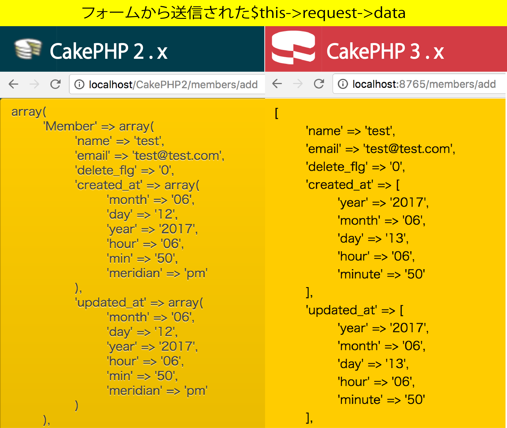

# 登録(add)

* データの更新(Update)について
* エンティティ更新の`edit()`

## 登録処理

ブラウザから`POST`されたデータ(`$this->request->data`)で、テーブルを更新する

```php
//app¥Controller¥MembersController.php
public function add() 
{
    // POSTの時の処理
    if ($this->request->is('post')) {
        $this->Member->create();
        // データの保存
        if ($this->Member->save($this->request->data)) {
            // 更新成功時の処理
            $this->Flash->success(__('The member has been saved.'));
            return $this->redirect(array('action' => 'index'));
        } else {
            // 更新失敗時(入力エラー含む)の処理
            $this->Flash->error(__('The member could not be saved. Please, try again.'));
        }
    }
    // 画面にプルダウンを表示するために関連モデルのデータを取得
    $meetings = $this->Member->Meeting->find('list');
    $this->set(compact('meetings'));
}
```

```php
//src/Controllers/MembersController.php
public function add()
{
    $member = $this->Members->newEntity();
    if ($this->request->is('post')) {
        $member = $this->Members->patchEntity($member, $this->request->getData);
        if ($this->Members->save($member)) {
            $this->Flash->success(__('The member has been saved.'));

            return $this->redirect(['action' => 'index']);
        }
        $this->Flash->error(__('The member could not be saved. Please, try again.'));
    }
    $meetings = $this->Members->Meetings->find('list', ['limit' => 200]);
    $this->set(compact('member', 'meetings'));
    $this->set('_serialize', ['member']);
}
```

## POSTのチェック

```php
if ($this->request->is('post'))...
```

* ここでは、まず`CakeRequest::is()`でPOST送信かどうかをチェック
    * (`GET`なら編集画面を表示するだけで更新はしない)
* `登録処理`は、`登録画面を表示する際`には`GET`で、`入力内容の送信`は`POST`でリクエストが送られる
* どちらの場合も、この`アクション`が呼び出される
* そこで、`POST`の場合だけ更新するような判断分岐が入っている
* GETかPOST送信かは、コントローラーの`requestプロパティ`にある`Request`インスタンス内の`is()`で調べることが可能
* is('post')`がtrueならば、POST送信されたと判断可能POSTされたなら、送信されたフォームの内容をもとにレコードの新規作成する
* `入力チェックエラー`などで更新できなかった場合や、`登録画面を初期表示`する場合には、画面のプルダウンの選択肢として、関連モデルのデータを検索している

## saveの準備

CakePHP2.xとCakePHP3.xでは`save()`でデータを登録する準備段階に違いがある

* 2.x→create() + save()
* 3.x→newEntity() + patchEntity() + save()

まずは先に`POST`されたデータがどんな形式で引き継がれてくるのか

下記の２行を追加。

```diff
+ debug ($this->request->data);
+ return
```

* 追加したら、ブラウザから`登録画面`(/meeting_members/add)にアクセスして登録
    * (DB更新の前に`return;`で処理を終了しているので、レコードは登録されない)
* すると、画面には下記のように表示される



CakePHPでは１レコードをこの形式で格納していることがわかる

### 2.x create() + save()

```php
array create (【初期値群】:【配列】)
```

* このメソッドは、`登録`のための`レコード`の`空枠`を作る
* 各項目の値は、DBに設定されたそれぞれの項目の初期値
* `$this->モデルクラス->create()`の結果を`debug()`で表示する

```php
debug($this->Member->create());return;
```


初期値を設定している`delete_flg`が表示されいる

ただ、`今回だけはDBに設定された値を初期値にしたくない！`という場合もある

* その場合は、引数に`項目名=>初期値`の形式の配列をセットしてあげる
    * そちらが優先される特にテーブル初期値で問題なければ引数は省略可能


### 3.x newEntity() + patchEntity() + save()

#### エンティティの作成(3.x)

```php
$members = $this->Members->newEntity();
```

CakePHP3.xでは`新しいエンティティを作成`する

* エンティティは`Members`クラスとして用意してある
* `new Members`というような形でインスタンスを作成するわけではない
* `$this` (コントローラー自身)にある`Members内のメソッドを呼び出して作成`する

CakePHPのコントローラーでは、そのコントローラーに関連づけられているモデルのプロパティが用意される

* MembersTable.php
* Member.php
* という２つのモデルを作成しているため、`Members``という名前のプロパティが用意される
* この`Members`プロパティに入っているのは、テーブルクラスのインスタンス
* ここでは`MembersTableクラスのインスタンス`が入っていることになる
* その中の`newEntity()`を呼び出すことで、エンティティを作成する


#### エンティティに値をマージする

```php
$members = $this->Members->patchEntity($members, $this->request->data);
```

* 作成されたエンティティのデータは、値なども設定されていない
* いわば、`空っぽのエンティティ`
* これに送信されたフォームのデータを組み込む
* `patchEntity()`
    * 第一引数に指定したエンティティを`マージ(組み込み)`する
    * 第二引数のデータを`マージ(組み込み)`する
* また、`getData()`は`$request->data`を取得するもの
* プログラムの内容は`POSTされたデータを丸ごと渡す`という意味で同義

```php
// 以下の２つは意味同じ
$members = $this->Members->patchEntity($members, $this->request->data);

$members = $this->Members->patchEntity($member, $this->request->getData());
```

このように、patchEntityでフォームの値をエンティティにマージできるのも、フォームを`フォームヘルパー`で生成したおかげ


## save()

保存は、モデル名のプロパティ(ここでは、Members or Member)にある`save()`を呼び出す

```php
mixed save (【レコードデータ:配列】, 【オプション:配列】)
```

* 第一引数の`レコードデータ`は、前述の`登録データの形式`の通り
* 第二引数の`更新オプション`は任意項目が、下記の指定を行うことが可能

| オプション名 | 説明 |
|:----|:----|
| 'validate' | `更新`前に入力チェックをするか。初期値:`true(行う)` |
| 'fieldList' | 更新可能な項目。`想定外`の項目を更新されないように、ここで更新可能な`項目名`を明示する。初期値:`array() (全項目)` |
| 'callbacks' | `コールバックメソッド`を呼び出すか。初期値:`true(前後とも呼び出す)` |

* そしてこのメソッドの戻り値は、`更新成功`の場合には`true`が、`更新失敗`の場合には`false`が返る
* ここで`更新失敗`には、`レコードデータの形式謝り`などの`システムエラー`だけでなく、`入力チェックエラー`も含まれる
* したがって、両者を見分けたい場合には、`更新前`に`入力チェックだけを先行して実施する必要がある

### 2.x

* ここで、CakePHP2.xでは`save()`に引数に、`CakeRequest::data`を丸ごと引き渡し
* `CakeRequest::data`の中には、`モデルクラス名`がセットされている
    * `save()`は更新する際に、その中の`自モデル`の部分だけを取り出して更新する
* つまり、`CakeRequest::data`を丸ごと渡せば、都合のいい部分だけ使って更新してくれる

### 3.x

```php
if ($this->Members->save($member)) {
```

* CakePHP2.xでは`CakeRequest::data`を丸ごと引き渡していた
* しかし、3.xではnewEntityで作成した空のEntityに対して、POSTされたデータをマージし、`マージしたエンティティを保存(save)`する

## レコード作成(Read)のテンプレートを作る

* CakePHPからデータベースを操作するには、モデルとして用意されている２つのクラスを利用する
* 前回作成した`Persons`を使って、データベースアクセスの基本を説明する
* まずは、テンプレート側から作成
* 前回使った`Persons`というモデルを引き続き利用する
* `add.ctp`を作成

```html
<!--Template/Persons/add.ctp-->
<div>
    <h3>Add Person</h3>
    <?=$this->Form->create() ?>
    <fieldset>
    <?php
        echo $this->Form->input('name');
        echo $this->Form->input('age');
        echo $this->Form->input('mail');
    ?>
    </fieldset>
    <?= $this->Form->button('Sumbit') ?>
    <?= $this->Form->end() ?>
</div>
```

ここでは、先に説明した`フォームヘルパー`という機能を利用`してフォームを用意
    * 送信先の指定もない、ということは、このフォームのアドレスにそのままPOST送信することになる
* 送信するフォームの内容は、'name', 'age', 'mail'という３つの入力フィールドの形で用意
    * これは、personsテーブルに用意してあったフィールド名そのまま
    * プライマリキーであるidはないプライマリキーは自動生成されるように設定してあるため用意する必要がない

#### ・<fieldset>タグについて

フォーム関係の前後には、`<fieldset>`というタグがある

* これはフィールド関係をまとめるためのもの
* `このタグ内にフォームのタグを出力すると、前後に仕切りを表示し、左右に余白などを作ってフォーム全体を一つにまとめる
* なくても動作に影響はないのが、つけたほうが見た目にも良い

### 入力チェック

また、`CakePHP 2.x`では入力チェックは、`save()`の中で行なっている

つまり、`save()`の戻り値が`false`(エラー)の場合というのは、`システムエラー`(更新エラー)だけでなく`入力チェックエラー`の場合もあり得るということ

しかし、この`save()の中で入力チェックもやってしまう`方式というのは便利ではあるが、困ることもある

例えば、`パスワードのチェック`のケース

パスワードは、DBには暗号化してから格納するが、`save()`の前に暗号化してしまうと、パスワードの長さの入力チェック不可

これは困る

そんなときには、下記のように、`入力チェック`と`更新`を`別々`に行う

```php
//app¥Controller¥MembersController.php
// 更新データをモデルにセット
$this->Members->set ($this->request->data);

// まずは入力チェック
if ($this->Members->validates()) {

    // 入力チェックOKなら更新
    if ($this->Members->save($this->request->data,
                array('validate' => false)))
        // 更新成功時の処理
    } else {
        //更新失敗時の処理
    }
} else {
    // 入力チェックエラー時の処理
}
```

このように、`Model::validates()`で`先に入力チェックだけ`を行う

(`save()`の第二引数で`入力チェックはしない`とオプションを指定`していることに、留意。)

`入力チェックエラー`のときに、画面の入力内容を`set()`で引き継いでいない

これは、`入力チェックエラー`時には、`CakePHPが直前の入力内容を自動的に画面に引き継いでいる`から

