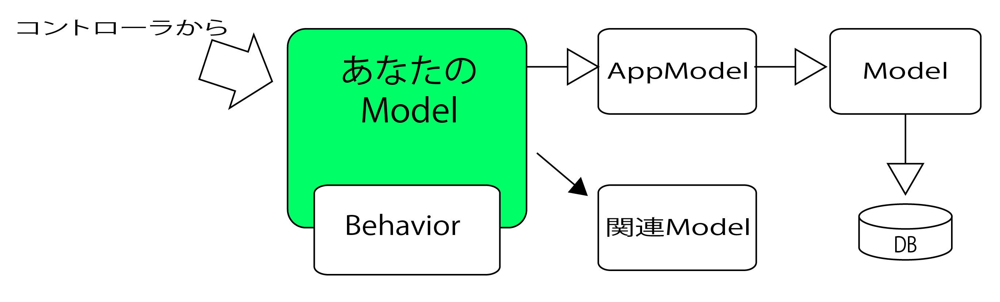
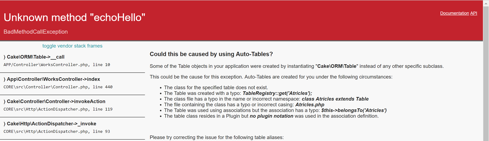
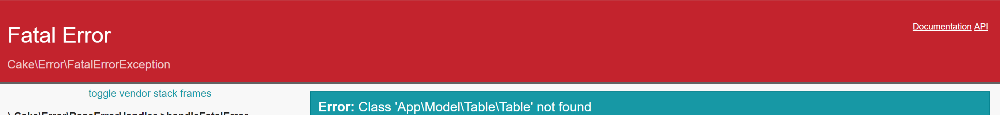

# Model層の全体像

* `Model`は`AppModelクラス`を継承する
* AppModelクラス
    * プロジェクト全体で共通の処理を記述するための`基底クラス`
        * `Modelクラス`を継承している
        


## Modelの基底クラスの基本機能

* データアクセス機能
* 関連モデル管理機能
* 入力チェック機能
* 共通アクセス機能

## Behavior

* `Modelクラス`の機能拡張クラス
    * 全モデル共通で使う処理は`AppModel`に作る
    * 一部モデルで使う処理は`Behavior`を作る
* CakePHPはver.3以降 モデルはつのクラスから構成されるようになった
    * `エンティティ(Entity)`
    * `テーブル(Table)`

## DBとモデルの準備

### エンティティ

* DBのデータをPHPのオブジェクトとして扱うようにしたもの
* テーブルのデータをPHPクラスに抽象化したもの
* DBに保存したり取り出したりしたデータは、全て`エンティティのインスタンス`

### テーブル

* テーブルとの間でやり取りするための仕組みを提供するもの
* `DBに用意されているテーブルへのアクセスに必要な情報を提供するもの`
* テーブルにエンティティを保存する際にも`テーブル内にあるメソッドを利用`する

## 最もシンプルなモデルクラス

モデルクラスの一番シンプルな実装

```php
<?php
//src/Model/Table/PersonsTable.php(3.x)

namespace App\Model\Table;

use Cake\ORM\Table;

class PersonsTable extends Table
{
    public function echoHello()
    {
        echo "hello";
    }
}
```

```php
<?php
//src/Controller/PersonsController.php(3.x)

namespace App\Controller;

use Controller\AppController;

class PersonsController extends AppController
{
    public function index()
    {
        $this->Persons->echoHello();
    }
}
```

* これでテーブルクラスと連動していることは確認が可能
* `検索`、`更新`といった基本的なデータアクセス機能が利用可能

# 名前空間について

* Tableは、`App\Model\Table`という名前空間に配置されている
* テーブルクラスも、ここに配置する

namespaceを書かないと以下のようなエラーとなる



# using文

use文の中でもuse Cake\ORM\Table;だけは必須

省略すると以下のようなエラーとなる



# エンティティクラスについて

* `src`フォルダの中の`Model`フォルダを開く
* この中には、３つのフォルダが用意されている
* エンティティは、基本的にテーブルの`単数形`で名付けられる

| フォルダ | 説明 |
|:----|:----|
| Behaviorフォルダ | ビヘイビアという、モデルのヘルパー機能を保管する |
| Entityフォルダ | エンティティのソースコードファイルを用意する |
| Tableフォルダ | テールのソースコードファイルを保管する |

```php
<?php
namespace App\Model\Entity;

use Cake\ORM\Entity;

class Person extends Entity
{
    protected $_accessible = [
        '*' => true,
        'id' => false,
    ];
}
```

## 名前空間はApp/Model/Entity

* エンティティは`Entity`というクラスを継承して作成される
* このEntityクラスが用意されているのが、app/Model/Entity
* エンティティとして作成されるクラスは、同じ名前空間に配置する

## Entityをuseする

* エンティティはEntityクラスを継承している
* このクラスを`use`しておく
* Entityのソースは、`Cake\ORM\Entity`に配置されている

## Entityを継承する

* エンティティは、`Entity`クラスを継承する

```text
class Person extends Entity
```

### $_accesibleについて

* デフォルトで生成されるクラスは、`_accessible`というプロパティが用意されている
    * `_accessible`: テーブルのフィールドに対する保護の設定
        * `id`: idフィールドへのアクセスを保護
        * `*`: それ以外のものはアクセスが許可される

## テーブルクラスについて

* `Table/`に用意されている
* `Table/PersonsTable.php`がpersonsテーブル用に作られたテーブルクラス
* テーブルクラスは、`テーブル名Table`といった形で命名されるのが基本

# 初期化処理とバリデーションの設定

* 自動生成されたテーブルクラスは、デフォルトで２つのメソッドが用意される

## initialize()

* 初期化処理を行う
* `parent::initialize($config);`で親クラスの処理を呼び出す
* およクラス呼び出し後、以下のような処理を行う

```php
$this->table('persons');
```

* テーブルの設定tableは、このテーブルクラスで使用するDBのテーブルを指定するもの
* 命名規約にしたがって名前をつけていれば自動的にテーブルを認識可能
* この`table()`を利用することで独自にテーブルを設定することも可能
* `$this->displayField('name');`
    * レコードの表題(タイトルのようなもの)として扱われるフィールドを指定するもの
    * レコード検索時にこのdisplayfieldで指定したフィールドの値が利用される
* `$this->primaryKey('id');`
    * プライマリーキーとなるフィールドを設定するもの
    * テーブルでプラマリキーに指定されているフィールドをそのまま指定する
    * 別のフィールドを指定しても、そのフィールドがプライマリキーになるわけではない

## バリデーション設定について

* `validationDefault`
    * テーブルの各フィールドに指定されるバリデーションの設定を行うためのもの

```php
$validator
    ->add('id', 'valid', ['rule' => 'numeric'])
    ->allowEmpty('id', 'create');
```

* `$validator`という変数があり、その中のメソッドを呼び出していることがわかる
    * `Validator`というクラスのインスタンス
    * ここでは、以下のようなメソッドを呼び出している

| メソッド | 説明 |
|:----|:----|
| add | 引数に指定したバリデーション設定を追加する |
| allowEmpty | 空の値を許可するように設定する |
| notEmpty | 空の値を許可しないように設定する |

