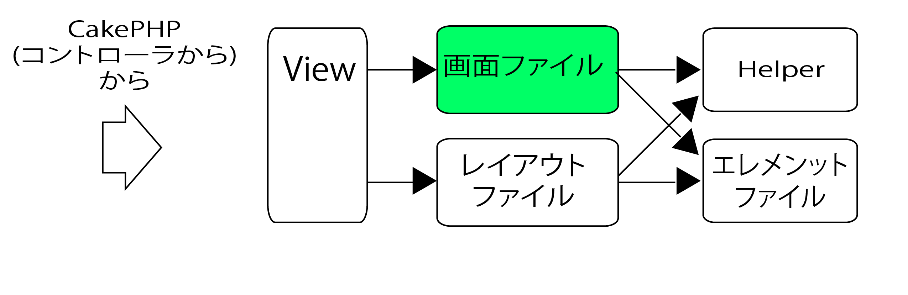
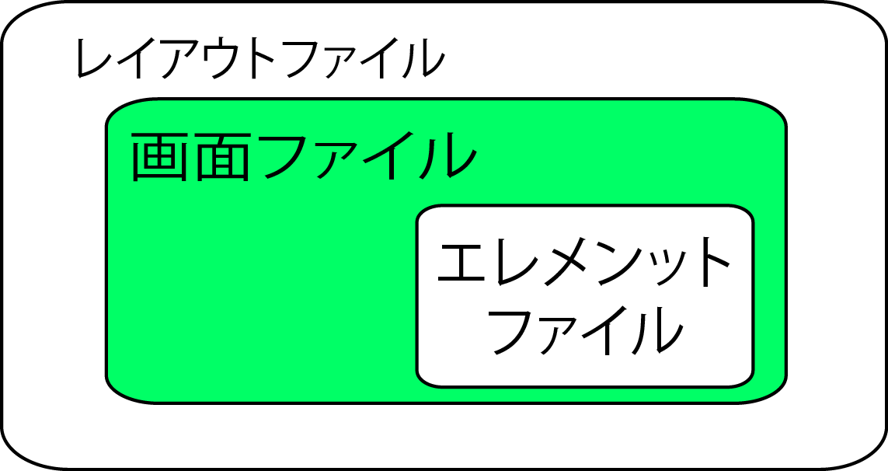

# View

## 概要

* 画面の表示を担当
* 表示用の`テンプレート`を用意し、ロードして表示する

## 全体像

* `表示画面`: `レイアウト・ファイル`と`画面ファイル`を合わせたもの
    * `画面ファイル`: アクションに対するレスポンス画面
    * 実際に`画面に表示されるもの`は`src`フォルダ内の`Template`フォルダ
`レイアウト・ファイル`
    * 画面中でシステム内共通の内容(ヘッダやフッタ)などを記述する
    * 画面右下のアイコンなどもCakePHPに用意されているレイアウト用のテンプレート
* `エレメント・ファイル`
    * 複数画面で使う画面パーツ



### 画面の構成

* src/Template/

| Element/ | 部品ファイル |
|:----|:----|
| Layout/ | 外枠など共通部分を記述したファイル |
| 自作ディレクトリ/ | アクションに対応したファイル |

* View層は`ビューの処理を行う部分`と`表示するテンプレート`に分割されてる
    * src/View/Helper

### 画面の処理

* src/View/Helper/
    * 共通化したい処理を記述したファイル 
* `Helperクラス`はロジックを軸に、共通化したい場合に使用する

### 画面ファイルの場所と名前

* `Controller`は`アクション`を終えると、`アクションのデフォルト画面`を表示する
    * `デフォルト画面`は、下記のように決まる

```text
HellosController::index()  //呼び出されたアクション
app/View/Hellos/index.ctp //デフォルト画面のファイル
```

* `src/Template/コントローラ名/アクション名.ctp`を作る
    * 拡張子`.ctp`は、`画面ファイル`を表す

#### どのレイアウト・ファイルを使うか

* `レイアウト・ファイル`はシステムで１つ
* デフォルトでは以下を使用

```php
src/Template/Layout/default.ctp
```

### 画面の構造

* Template/Layout/default.ctpの仕組み
    * `レイアウト・ファイル`で`システム共通の内容`を表示
    * `画面ファイル`で`当該アクションに特有の内容`を表示
    * `エレメント・ファイル`で`随時共通パーツ`を表示



# フォームヘルパーを利用する

* フォームヘルパーと$this->Form
* フォームを作ってみる
* 入力用タグの生成
* 主なフォームタグ生成メソッド
* ラジオボタン/セレクト項目の作成
* 日時のためのフォーム作成

## フォームヘルパーと$this->Form

* 送信先のアドレスはアプリケーションやアクションの名前をもとに正確に指定する必要がある
    * そこで用意された、CakePHPで利用するフォーム関係のタグを生成する専用機能
        * `ヘルパー`とは、ビューの出力生成を補佐するためのプログラム
            * Webページの表示用タグを自動生成するためのクラスのこと、と考えると良い
            * このヘルパーには、生成する内容に応じていくつかのものが用意されている
            * フォーム関係を生成するものは`フォームヘルパー`と呼ばれる
* フォームヘルパーは`FormHelper`クラスとして用意されている
    * `Form`プロパティにインスタンスが設定されている
    * この中に、フォーム関係のタグを生成するためのメソッドが用意されており、これらを使ってタグを生成していく

## フォーム生成メソッド

* form開始タグと終了タグを生成する
    * このときにFormのFは大文字

```php
$this->Form->create( モデル,オプション ); // form開始タグ(<form>)と同義 

/** この内側にフォームを生成していく **/

$this->Form->end();                    // form終了タグ(</form>)と同義 
```

## create()

* `<form>`の開始タグを生成する
    * 引数はこのフォームのデータが格納されるモデルの名前
        * `○○モデルの更新フォームである`ことを宣言する
* フォームの内容をデータベースに保存する際に使用
    * モデル不使用の場合にはnull
* 以下と同義の内容が出力される

```html
<form method="post" action="">
```

## create()の第二引数

* `オプション`設定
* タグの属性とその値を連想配列にまとめたもの
    * 例: 入力フィールドに初期値のテキストを設定

```html
['value'` => 'please input...']
```

* type
    * 送信フォームの種類(初期値はPOST)
        * typeを指定しない場合にはPOSTになる
    * 取り得る値は`httpメソッド`(PUT,POST,GET,DELETE)か`file`(ファイルアップロードの場合)
* url
    * フォーム送信先のアクションを表すURI文字列かルーティング配列
    * 初期値はNull(画面表示アクションと同じアクションに送信する)

## end()

* 閉じタグ
* SecurityComponentに必要な hidden フォーム要素を挿入可能

```php
string end(【オプション：文字列or配列(初期値：null)】)
```

* data-type
    * `end(['data-type' => 'hidden'])`とすることで、フォームをhiddenにできる
* div
    * divをfalseにする場合は以下のようにする

```php
$this->Form->input('hoge', [
    'templates' => [
        'inputContainer' => '{{content}}'
    ]]);
```

## submit()

`ラベル名`は`ボタン・ラベル`として表示する

```php
string submit(ラベル名：文字列(初期値:submit), オプション:配列(初期値:null))
```

```text
<input type="submit" value="NAME">
```

* URL(`://`を含む)かファイル名(`.png`などの拡張子を含む)をセットした場合には、`画像ボタン`を生成する

### submit()のオプション

* type
    * `submit(初期値)`の場合は通常の送信ボタンを生成
    * `reset`の場合はリセットボタンを生成

## button()

* submit()と異なり、引数を空にして使用不可

```php
string button(ラベル名：文字列, オプション:配列(初期値:null))
```

### button()のオプション

* before
    * `INPUTタグ`の前に出力するタグ文字列
* after
    * `INPUTタグ`の後に出力するタグ文字列
* type
    * `submit(初期値)`の場合は通常の送信ボタンを生成
    * `reset`の場合はリセットボタンを生成

## フォームの初期値

* FormHelperは特に初期値の指定がなければ、`コントローラ`から引き継がれた`FORMデータ`の内容を初期表示する
    * 現時点では、Modelから引き継ぎがないため、空が挿入されている

## 送信後の値

* フォーム送信後もと入力フォームに残る
* 例: `入力チェック`でエラーがあった場合、一般的には、直前の入力内容を画面に表示する
    * しかし、内部的に`CakeRequest::data`の内容を画面ファイルから直接参照可能なため、`set()`をし直し不要

## input()

* 入力項目の様々な種類を作成可能

```php
string input(フィールド名：文字列, オプション名：配列(初期値：array()))
```

* `フィールド名`はこの項目で表示する項目の名前
* `create()`で指定した`モデル名`が`テーブル名`を表す
    * この`フィールド名`が、そのテーブルの`項目名`を表す
* また、`モデル・クラス`に関連先モデルを定義している場合は複数テーブルの一括更新も可能
    * その場合は関連先モデルの項目を`モデル名(キャメルケース) + .+ フィールド名`と表記する

### checkboxで使用するオプション

* checked
    * 初期状態でチェックボックスをチェック状態にするか
    * true:チェックする、false:チェックしない(初期状態)

### radioで使用するオプション

* legend
    * `<fieldset>`の見出しの値

### 択一型の項目(select,radio)で使用するオプション

* options
    * 選択時の一覧を配列形式でセットする
    * 配列の内容は`'選択肢のvalue'=>'表示内容'`の書式となる
    * この書式は`Model::find('list')`で検索した結果と同じ書式
        * 検索結果をそのままオプションとしてセット可能
        * 例: フィールド名が`meeting_room_id`で、`MeetingRoomモデル`との`hasMany関連`が設定されている場合
        * コントローラで検索結果を`$meetingRoom`に`set()`しておくと、`options`は省略可能

### selectで使用するオプション

* multiple複数行選択を許すか
    * true:許す
    * false:許さない(初期値)

### プルダウン型で使用するオプション

* empty
    * プルダウンに空行を表示するか
        * false:表示しない(初期値)
        * true:表示する
        * 文字列：空行に指定文字列を表示する

### 日時系(datetime,date,time)項目で使用するオプション

* dataFormat
    * `年月日`のプルダウンの表示順序初期値：`DMY`
* separator
    * `年月日`のプルダウン間の区切り文字初期値:`-`
* minYear
    * `年`プルダウンの最小値(初期値：今年-20)
* maxYear
    * `年`プルダウンの最大値(初期値：今年+20)
* orderYear
    * `年`プルダウンの並び順('asc':昇順、'desc':降順(初期値))
* monthName
    * `月`を表記方式(true:アルファベット(初期値)、false:数値)
* timeFormat
    * `時`プルダウンの表示形式(`12`:12時間制、`24`:24時間制)
* interval
    * `分`プルダウンの感覚(1〜59)初期値:1

## フォームを作ってみる

### create()の第二引数

* 次にcreate()の第二引数にフォームに関するオプション設定の情報を用意する
* これは、各種の設定を連想配列でまとめたものになる
* 具体的には`type`と`url`を用意しておくのが基本と考える
    * `'type' => 'post' または 'get'を指定`
    * `'url' => ['controller' => '○○', 'action' => '○○']`
* urlは`contrller`と`action`の２つの項目を持つ連想配列を指定する
    * これでそれらをもとに自動的にurlが設定される

### 入力用タグの生成

* FormHelperの入力フォームの生成にはいくつか種類がある
* input()を使わずに`textarea()`や`select()`といった個別のメソッドを使ってタグを生成可能

### 主なフォームタグ生成メソッド
#### FormHelperで各種FORM要素の生成

なお`NAME`とあるのは、name属性に設定するタグの名前

```text
<?=$this->Form->text('NAME') ?>
↓
<input type="text" name="NAME">
```

* パスワード入力フィールドを作成
    * `<?=$this->Form->password( 'NAME' ) ?>`
* 非表示フィールド
    * `<?=$this->form->hidden( 'NAME',['value'=> 値 ]) ?>`
* テキストエリア
    * `<?=$this=>Form->textarea( 'NAME' ) ?>`
* チェックボックス
    * `<?=$this->Form->checkbox( 名前, ['id'=> 値 ]) ?>`
        * これはチェックマークの部分だけなので、テキスト等の表示はない
        * これはラベルとして作成する必要がある
* ラベル
    * `<?=$this->Form->label( タグのID, 表示テキスト ) ?>`
        * `<label>`によるラベルを作成する
        * これは、第一引数にはラベルを設定するタグのIDを、第二引数に表示するテキストを指定する

```php
<div>
    <h3>Index Page</h3>
    <p><?= $message ?></p>
    <?=$this->Form->create(null,[
        'type' => 'post',
        'url' => ['controller' => 'Hellos', 'action' => 'index']]
    ) ?>
        <?=$this->Form->password('pw') ?>
        <?=$this->Form->hidden('hide',['value'=>'hide message']) ?>
        <?=$this->From->checkbox('check',['id'=>'check']) ?>
        <?=$this->Form->label('check','check!!') ?>
    <?=$this->Form->end() ?>
    </form>
</div>
```

### ラジオボタン/セレクト項目の作成

* ラジオボタン
    * `<?=$this->Form->radio( 名前, [ ボタン情報 ]) ?>`
* セレクト
    * `<?=$this->Form->select( 名前, [ 項目情報 ]) ?>`
* 第二引数に、表示する項目の情報を連想配列としてまとめたものを用意
* 第三引数に、オプション設定(属性の値などを設定するためのもの)を用意
* 表示する項目の情報は、一つ一つの項目の情報をまとめた連想配列の連想配列になる

```php
[
    ['value'=> 値, 'text'=> 表示テキスト ],
    ['value'=> 値, 'text'=> 表示テキスト ],
    ...略...
]
```

* 表示項目は、最低限、`'value'`と`'text'`が必要
    * valueが、その項目を選択した時の値となる
    * textが項目として表示されるテキストになる
* 下のリストは、ラジオボタンと２つのセレクトを表示するサンプル

```html
<div>
    <h3>Index Page</h3>
    <p><?= $message ?></p>
    <?=$this->Form->create(null,[
        'type' => 'post',
        'url' => ['controller' => 'Hellos', 'action' => 'index']]
    ) ?>
        <?=$this->Form->radio('radio',[
            ['value'=>'男','text'=>'male','checked'=>true],
            ['value'=>'女','text'=>'female']
        ]) ?>
        <?=$this->Form->select('select2',[
            ['value'=>'Mac','text'=>'Mac OS X'],
            ['value'=>'Windows','text'=>'Windows 10'],
            ['value'=>'Linux','text'=>'Linux']
        ],['multiple'=>true]) ?>
        <?=$this->Form->submit('OK') ?>
    <?=$this->form->end() ?>
    </form>        
</div>
```

* セレクトは、ここでは複数項目を選択するのに、`['multiple'=>true]`という値を第三引数に指定
    * すると、自動的に一覧リストの形で表示されることがわかる
* これを付けず、１つだけが選択される場合は、自動的にポップアップメニューのスタイルになる

### 日時のためのフォーム作成

* 日時関係のメソッドは、入力するためのポップアップメニューを自動生成する
* 年月日のポップアップメニュー
    * `<?=$this->Form->date( 名前, 年月日の設定 ) ?>`
    * 第二引数には、年月日それぞれのポップアップメニューの設定を連想配列にまとめたものを用意する

```php
[ 'year'=> 年の設定 ,
  'month'=> 月の設定 ,
  'day'=> 日の設定 ]
```

* 時分のポップアップメニュー
    * `<?=$this->Form->time( 名前 , 時分の設定 )` ?>`
        * 時分を入力するメニューを自動生成する第二引数
            * それぞれのポップアップメニューの設定を連想配列にまとめたものを以下のように用意する
        * intervalは、分のポップアップメニューに表示する項目
            * これがないと、0〜59までの数字が表示されるメニューが作成される
        
```html
['interval'=> 間隔 ,
    'hour'=> 時の設定 , 
    'minute'=> 分の設定 ]
```

* 間隔を指定
    * `<?=$this->Form->year( 名前, 年の設定 ) ?>`
    * `<?=$this->Form->month( 名前, 月の設定 ) ?>`
    * `<?=$this->Form->day( 名前, 日の設定 ) ?>`
    * `<?=$this->Form->hour( 名前, 時の設定 ) ?>`
    * `<?=$this->Form->minute( 名前, 分の設定 ) ?>`
* `'interval'=>10`とする場合 
    * 10分ごとの値だけがメニューに表示されるようになる
        * 0,10,20,30,40,50

### 年月日時分の各項目

* 第二引数の設定は、生成されるタグの属性に指定する値などを連想配列としてまとめたものを用意する

```php
'minYear' => 最初の年
'maxYear' => 最後の年
```

これらを指定することで、minYear`からmaxYear`までの年の値をポップアップメニューに表示可能

```php
<div>
    <h3>Index Page</h3>
    <p><?= $message ?></p>
    <?=$this->Form->create(null,[
        'type' => 'post',
        'url' => ['controller' => 'Hellos','action' => 'index']]
    ) ?>
    <?=$this->Form->date('date',[
        'year'=>['style'=>'width:100px;';],
        'month'=>['style'=>'width:100px;';],
        'day'=>['style'=>'width:100px;';],
    ]) ?>
    <?=$this->Form->time('time',[
        'interval'=>5,
        'hour'=>['style'=>'width:100px;']
    ]) ?>
    <?=$this->Form->submit('OK') ?>
    <?=$this->form->end() ?>
    </form>
</div>
```

### エラー情報の取得

* 入力エラー時のメッセージ表示形式を変える
* サンプルとして、会議室編集画面に下記の１行を追加してから入力チェックエラーになるような入力をしてみてください

```php
//app¥View¥Meetings¥edit.php
debug($this->Form->validationErrors);
```

すると、画面に下記のように表示される

```php
array(
    'Meeting' => array(                // モデル名
        'title'    => array(            // フィールド名
            (int) 0 => 'minLength',     // エラーメッセージ1
            (int) 1 => 'numeric'        // エラーメッセージ2
        )
    ),
    'MeetingRoom' => array(),
    'Member' => array()
)
```

* まずモデルクラスがあり、その中にエラーのあるフィールドだけがセットされている
* さらにその中にはエラーになったチェック項目のエラーメッセージがセットされている
* 入力チェックの定義の`message`にメッセージを設定していないので識別名がセットされている
    * あくまでここにセットされているのはエラーメッセージ
    * メッセージが２つセットされている
        * `last`に`false`を設定して１つ目のチェックでエラーでもチェックを終了しないようにしているため

ここまで詳細な情報が必要ない場合は、下記のメソッドでことは足りる

```php
debug($this->Form->isFieldError(フィールド名：文字列))
```

## その他のHelper

CakePHPには他にも有用なHelperが標準で提供されている

| Helper名 | 用途 |
|:---|:---|
| Cache | 画面コンテンツをキャッシュするヘルパー |
| Jquery | JQueryを使うためのヘルパー |
| Js | JSを使うためのヘルパー |
| Mootools | Mootoolsを使うためのヘルパー |
| Number | 数値を生成するためのヘルパー |
| Paginator | 一覧画面を生成するためのヘルパー |
| Prototype | Prototypeを使うためのヘルパー |
| Rss | RSSフィードを生成するためのヘルパー |
| Session | セッションを操作するためのヘルパー |
| Text | アドレスをリンク化したり、特定文字列をハイライト化したりと、文字列を操作するヘルパー |
| Time | 時間の判断や表記のためのヘルパー |

## PaginatorHelper

* 一覧画面の作成を助けるヘルパー
* このヘルパーは`PaginatorComponent`とセットで利用する

実際の一覧画面ファイル(index.ctp)

```html
<pre class="brush:php; toolbar:false" title="PaginatorHelperの利用">
    <table>
    <tr><!-- 並び替えリンク付き見出しを表示 -->
        <th><?php echo $this->Paginator->sort('id'); ?></th>
        <th><?php echo $this->Paginator->sort('title'); ?></th>
        【省略】
    </tr>
<?php foreach ($meetings as $meeting): ?>
    <tr>
        <td><?php echo h($meeting['Meeting']['id']; ?></td>
        <td><?php echo h($meeting['Meeting']['title']; ?></td>
        【省略】
    </tr>
<?php endforeach; ?>
    </table>

    
<?php //ページカウンターを表示
    $format = 
        'Page {:page} of {:pages}, '    // 何ページ中　何ページ目
    .    'showing {:current} records out of {:cound} total, '    // 何件中　何件
    .    'starting on record {:start}, ending on {:end}';    // 何件目から何件目まで
    echo $this->Paginator->counter (array(
        'format' => $format
    ));
?>
    
    <div class="paging">
<?php
    // 全ページへのリンクを表示
    echo $this->Paginarot->prev(
        '< previous', array(),
        null, array('class' => 'prev disabled')
    );
    // 他ページへのリンクを表示
    echo $this->Paginator->next(
        'next >', array(),
        null, array('class' => 'next disabled')
    );
?>
```

* 以下のタグを生成してくれる
* 並び順変更リンク付き見出し(PaginatorHelper::sort())
* ページカウンター(PaginatorHelper::counter())
* 他ページへのリンク(PaginatorHelper::prev()、numbers()、next()、first()、last())

### 絞り込み条件リンクの作成

* 今日の会議予定を一覧で表示
* 先ほどの画面ファイルに、下記の１ブロックを追加する

```php
<?php // 絞り込みリンクを作成
    // namedパラメータ`today`がセットされているか
    if ((isset($this->param['named']['today'])
    && ($this->params['named']['today'] == true )) {
        
        // namedパラメータを削除した`全て`へのリンクを作成
        $str1 = $this->Paginator->link('全て',
            array('today'=>null));
        $str2 = '今日の会議だけ';
        
    } else {
        
        // namedパラメータを付与した`今日`へのリンクを作成
        $str1 = '全て';
        $str2 = $this->Paginator->link('今日の会議だけ',
            array('today' => true));
            
    }
    echo sprintf("絞り込み条件：[ %s | %s]", $str1, $str2);
?>
```

* `PaginatorHelper::link()`
    * 独自の`namedパラメータ`を付加した自アクションへのリンクを作成してくれる
    * そして作られたリンクをクリックすると、`namedパラメータ`はコントローラに引き継がれる
    * 引き継ぎ先であるコントローラの`indexアクション`を、下記のように修正

```php
/* app¥Controller¥MeetingsController.php */

pucliic function index() {
    $scope = array();
    // `今日分だけ`パラメータがセットされていれば条件追加
    if (isset($this->request->params['named']['today'])
    && $this->request->params['named']['today'] == true) {
        $today = date ('Y-m-d');    // 今日の日付
        $scope = array('start_time LIKE '=> $today . ' %');
    }
    
    $this->Meeting->recursive = 0;
    $this->set('meetings', $this->paginate(null, $scope));
}
```

* ここまでできたら、実際に一覧画面で`今日の会議だけ`を選択
* 実際に今日の会議データだけが抽出可能

### 画面の共通処理

* 画面ファイルの一部を共通化したい場合は`エレメント・ファイル`
* ロジックを共通化したい場合は`ヘルパー・クラス`

#### 画面パーツの共通化 Element

* `エレメント・ファイル`は、画面ファイル(.ctp)の共通部分を別ファイルに切り出したもの
* 今回は例として`広告を表示するDIVをエレメントとして切り出す`
* まずは画面ファイルに下記のエレメントの呼び出しを追加

```php
<?php
/* app¥View¥Meetings¥view.ctp */

    // 広告を表示
    $my_id = $meeting ['Meeting']['id'];
    echo $this->element ("ad", array('data_id' => $my_id));
?>
```

* 続いて、`エレメント・ファイル`本体を作る

```html
<!--広告エレメント(app¥View¥Elements¥ad.ctp-->
<?php
    echo sprintf("%s(ID:%s)",
        $meeting ['Meeting']['title'],
        $data_id
    );
?>をご覧のあなたに特別なお知らせ!
```

* これでブラウザから会議情報を参照
* `エレメント`が表示される
* まず`エレメント`を表示する側から見ていく。

```php
string element(【エレメント名：文字列】,【引数：配列】)
```

* `エレメント名`は、`エレメント・ファイル名`から`.ctp`を除いたもの
* `引数`には`エレメント・ファイル`に引き継ぐ情報を配列形式でセットする
* `エレメント本体`
    * 引数で渡された`data_id`は`エレメント・ファイル`内で`$data_id`として参照が可能
* また、Controllerで`set()`された`$meeting`も参照可能
* 画面ファイルでの`$this`には、`エレメント・ファイル`内でも`$this`として使える
* `画面ファイル`の共通部分を簡単に`エレメント・ファイル`に切り出し可能
    * `エレメント・ファイル`内でも、`画面ファイル`内と同様に、ヘルパーなどを使用可能
    
#### 画面ないロジックの共通化 Helper

* `ヘルパークラス`の自作方法
* `elemtn()`は乱用されるべきではない
    * 引数を忘れてしまう恐れがあったり、引数が増えた時に全使用箇所の修正が必要になるため
* 独自の`ヘルパー`を作って、その中で`エレメント`を読み込む
* 下記のような`Helperクラス`を作る

```php
<?php
/* app¥View¥Helpers¥MyHelper.php */
class MyHelper extends AppHelper {
    function ad ($options = array()) {
        
        $options += array('id' => 'unknown');    // オプション初期値セット
        
        return $this->_View->element('ad',
            array('data_id' => $options['id']));    
    }
}
```

* ヘルパークラスの約束事
    * クラス名は、`ヘルパー名 + Helper `とする
    * ファイル名は、`クラス名 + .php`とする
    * ヘルパー名は、`キャメルケース`とする
    * ヘルパークラスは、`AppHelper`クラスを継承する
    * ヘルパークラスは、`$this->_View`で`Viewインスタンス`を参照可能

```php
/* app¥Controller¥MeetingsController.php */
class MeetingsController extends AppController {
    
    var $helpers = array('My');        // この行を追加
    
}
```

* これで画面ファイル内から`MyHelper`が使える
* 最後に前述の`エレメント`を直接呼び出していた箇所を、下記のように修正する

```php
<?php
//自作ヘルパーの呼び出し
/* app¥View¥Meetings¥view.ctp */
    // 広告の表示(Helper)
    echo $this->My->ad();
?>
```

#### 既存Helperの継承

* 既存の`ヘルパークラス`(HtmlHelper、FormHelperなど)の拡張
* `Helper`の独自拡張の方法

```php
<?php
//FormHelperを継承した自作ヘルパー
/* app¥View¥Helpers¥MyHelper.php */

App::uses('FormHelper', 'View/Helper');

class MyHelper extends FormHelper {
}
?>
```

* 上のソースでは`App::uses()`で`FormHelper`を読み込んでから継承している
* ここまでで画面ファイルから`echo $this->My->input();`とする場合、入力フォームが出力可能
* しかし既存の`$this->Form`を全部書き換えるのは大変
* そういう場合は、使用宣言しているコントローラ側で、以下のソースのようにする場合 
* `MyHelper`を`Formhelper`として使用宣言したことになる

```php
//自作ヘルパーを`Form`として利用宣言
/* app¥Controller¥MeetingsController.php */

class MeetingsController extends AppController {
    
    // var $helpers = array('My');
    
    var $helpers = array('Form' => array('className' => 'My'));

〜以下略〜
```

* 画面ファイルでは以下のソースのように、あたかも`FormHelper`かのように自作ヘルパーを呼び出し可能
* これなら既存のソースコードに、一切影響を及ぼさない

```php
<?php
/* app¥View¥Meetings¥view.ctp */
    // 広告を表示(Helper)
// echo $this->My->ad();

    echo $this->Form->ad();
?>
```

# コントローラーを修正する

PersonController.phpを作成

## initialize()

* ページネーションは、`Paginator`というコンポーネントとして用意されている
* これを利用するには、`loadComponent`を使ってロードしておく
    * コントローラー側の`initialize()`などでロード

## index()

* ページのエンティティは、コントローラーの`paginate()`で取り出し可能
    * エンティティを取り出すだけで、そのページに表示するエンティティがまとめて取り出せる
* あとはビューテンプレート側でforeachなどでエンティティを取り出し処理していくだけ
* `http://localhost:8765/persons`にアクセスして表示を確認
* Paginatorを利用してエンティティが取得され、一覧表示される

# $paginateによるページネーション

* `Paginator`は、`$paginate`という変数を読み込んでページネーションのための設定を行う
    * コントローラー内にあらかじめこの変数(プロパティ)を用意する

```php
public $paginate = [
    設定名 => 値,
    設定名 => 値,
    ....
];
```

* `$paginate`は、連想配列設定の項目をキーにしてその値を指定する
    * 用意できる設定
        * エンティティ数
        * 表示順序
        * 取得するフィールドの指定

## エンティティ数の指定

* `limit => 数字`
* １ページあたりのエンティティ数を指定する
* これにより、`paginate()`実行時に指定した数だけエンティティが取り出されるようになる

## 表示順序の指定

* 並び順を設定する
* これは連想配列になっている
* 並び替えの基準となるフィールド名に'asc'または'disc'のいずれかの値を指定する

```php
order => [ フィールド => 'asc' or 'disc',
　　　　　フィールド => .....]
```

## 取得するフィールドの指定

* 取得するフィールドを指定するためのもの
* `find()`などではフィールド名の配列を用意することで特定のフィールドの値だけを抜き出せる
    * 同様の働きをPaginatorに持たせることが可能

```php
fields => [ フィールド1, フィールド2, .....]
```

# Viewの作成

## 画面パーツの共通化『Element』


* Template/Element/に作成
* ここで作成するページャを各一覧画面で共通して使用する部品として扱う
* `View層`の画面ファイルの一部を共通化したい場合エレメント・ファイルを利用する
    * エレメント・ファイルは、画面ファイル(.ctp)の共通部分を別ファイルに切り出したもの
* 続いて、画面ファイルにエレメントの呼び出しを追加する
* View側は、単純に$personsで渡された値からエンティティをforeachで繰り返し取り出し、中身を表示する、というだけのシンプルなものを用意する

# Paginatorヘルパーによるページリンク

* CakePHP3には、`Paginatorヘルパー`というヘルパーが用意されている
* ページ移動のリンク作成を支援してくれるのが`Paginatorヘルパー`
* テンプレート(index.ctp)を開き、適当なところに、下のリストタグを記述
* ここでは、`$this->Paginator`というものにあるメソッドを呼び出している
* この`$this->Paginator`が、Paginatorヘルパーのオブジェクトが設定されているプロパティ

## リンク生成

* 前のページに戻るリンク
    * `<?= $this->Paginator->prev( 表示テキスト ); ?>`
        * 前のページに戻るためのリンクを生成する
        * 引数には、リンクに表示するテキストを指定する
* 次のページに進むリンク
    * `<?= $this->Paginator->next( 表示テキスト ); ?>`
        * 次のページに戻るためのリンクを生成する
            * 引数にはリンクに表示するテキストを指定する
* 最初のページに戻るリンク
    * `<?= $this->Paginator->first( 表示テキスト ); ?>`
        * 最初のページに戻るリンクを生成する
            * これは、最初のページが表示されているときは自動的に非表示になる
* 最後のページに進むリンク
    * `<?= $this->Paginator->last( 表示テキスト ); ?>`
        * 最後のページに進むリンクを生成する
            * これは、最後のページが表示されているときは自動的に非表示になる
* ページ番号のリンク
    * `<?= $this->Paginator->numbers(); ?>`
        * これは、表示されているページの前後のページ番号のリンクを自動的に表示するもの
