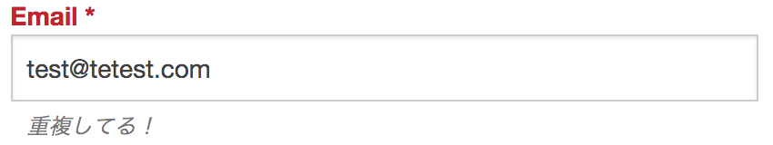

# バリデーション

* `テーブルクラス`で利用する方法が主となる

## 基本形

```php
public function validationDefault(Validator $validator)
{
    return $validator; //Validatorに必要な設定を追加し最後にreturn
}
```

## どこになにを？何をどこに？

```php
->適応したいルール('DBカラム名', '表示したいメッセージ')
```

## 実行タイミング

* merge実行時
* **save実行時**

```php
$member = $this->Members->patchEntity($member, $this->request->getData());
debug($member->errors());
if ($this->Members->save($member)) {
    $this->Flash->success(__('The member has been saved.'));

    return $this->redirect(['action' => 'index']);
}
$this->Flash->error(__('The member could not be saved. Please, try again.'));
debug($member->errors());
```

## 実行タイミング

```php
//patchEntityとsaveのタイミングで計２回
$member = $this->Members->patchEntity($member, $this->request->getData());
$this->Members->save($member)
```

## 計２回

* ２種類のバリデーションが自動的に実行されている
    * **PatchEntity実行時**
        * `validationDefault()`が呼ばれる
    * **save実行時**
        * `buildRules()`が呼ばれる

## 適宜エラーメッセージを表示して確認

```php
debug($member->errors());
```

## デバッグキットから参照可能

### Variablesを押下


### errorsを押下


## validationDefault()

* `バリデーションオブジェクトを用意`するためのもの
    * バリデーションオブジェクト: このテーブルへの保存時、自動的に作成される
* 引数には`Validator`というクラスのインスタンスが渡される
    * `Validator`: バリデーションを管理するクラス
        * テーブルでエンティティの保存作業が行われる時に利用される

## 処理の概要

* `Validator`に、必要なバリデーションの設定を追加し、最後に`return`する
    * その`Validator`がデータ保存時に実行され、値がチェックされる

# rules

| ルール | チェック内容 |
|:----|:----|
| notEmpty | 入力されているか |

## 桁数チェック系

| ルール | チェック内容 |
|:----|:----|        
| between,最小,最大 | 文字数が【最小】〜【最大】の間か |
| minLength,最小 | 文字数が【最小】桁数以上か |
| maxLength,最大 | 文字数が【最小】桁数以上か |

## 書式チェック系

| ルール | チェック内容 |
|:----|:----|
| alphaNumeric | 英数字か |
| numeric | 数字または数字形式の文字列か |
| naturalNumber,0を含むか | 自然数か |
| decilal | 数値か(少数対応) |
| boolean | boolean値で取り得る値か |
| date | 日時として適切か |
| datetime | 日時として適切か |
| time | 時刻として適切か |
| email | メールアドレスとして適切か |
| ip | ipアドレスとして適切か |
| url | URLとして適切か |

## アップロードファイルチェック系

| ルール | チェック内容 |
|:----|:----|
| extension,拡張子配列 | ファイル名の拡張子が【拡張子配列】の中に存在するか |
| mimeType,MIME配列 | ファイルのMIMEタイプが【MIME配列】の何かと一致するか |
| uploadError | ファイルアップロードエラーが発生していないか |

## 他レコードチェック系

| ルール | チェック内容 |
|:----|:----|
| isUnique | 他のレコードに存在しない値か |

## ruleとmessage以外のパラメータ

| パラメータ名 | 内容 | 省略時初期値 |
|:----|:----|:----|
| 識別名 | そのチェックの名前 | 必須 |
| allowEmpty | 未入力を許すか | false(許さない) |
| required | 必ず送信されてくる項目か | false(任意) |
| last | エラー時、この項目のこれ以降の入力チェックをやめるか | true(止める) |
| on | 特定処理でのみチェックする | null(両方) |

# 基本的な書き方

* [参照ファイル](https://github.com/aki-creatist/CakePHP3/blob/develop/src/Model/Table/MembersTable.php)
    
## フィールドとルールを指定

* `Validator`にバリデーションの設定を組み込む
    * `Validator`に用意されている各種のメソッドを利用

```php
public function validationDefault(Validator $validator)
{
    $validator
        ->email('email') //未入力と形式が異なる際にマージ後のエンティティのerrors配列に格納される

    return $validator;
}
```

## 初期表示メッセージ

* 初期表示されているメッセージはCakePHPの奥深くに存在している


* addにアクセスし、何も入力せずに送信すると、エラーメッセージが表示される


## メッセージ(設定)の追加

* 次に独自のエラーメッセージを追加する
* 第二引数にエラー時のメッセージを値として指定する

```diff
- ->email('email')
+ ->add('email', 'validFormat', [ // email()からadd()に置き換え
+     'rule' => 'email',
+     'message' => '正確に入力して！'
+ ])
```


* `$validator->add`
    * [詳細](https://book.cakephp.org/3.0/ja/core-libraries/validation.html#id8)
* メールのチェックは、`'validFormat'`利用する
    * ruleに`email`を指定する
        * 値がメールアドレスの型式かをチェック可能
    * [詳細](https://book.cakephp.org/3.0/ja/core-libraries/validation.html#id12)

## 一意フィールドルールの作成

* 重複するアドレスはエラーとなるように設定
* `buildRules()`にisUniqueを追加する
    * [詳細](https://book.cakephp.org/3.0/ja/orm/validation.html#id12)



## 完成

* `$validator->notEmpty( フィールド名 );`
    * 指定したフィールドの値が空かどうかをチェックするもの
    * notEmpty空の値を却下する

```php
//メールアドレスの空文字とアドレスの形式と重複を分けてチェックを行なう例
public function validationDefault(Validator $validator)
{
    $validator
        ->notEmpety('email', '入力必須！')
        ->add('email', 'validFormat', [
                    'rule' => 'email',
                    'message' => '正確に入力して！'
                ])
    return $validator;
}

public function buildRules(RulesChecker $rules)
{
    $rules->add($rules->isUnique(['email'],'重複してる！'));

    return $rules;
}
```


## 注意

* mailは初期状態だと、空文字のチェックとメール形式のチェックの両方を行う
* メッセージを変更する処理を追記すると形式のチェックしか行わなくなる

## Validatorクラスのメソッド

* emailとnotEmpety以外にも様々用意されている

### ruleとmessage以外のパラメータ

下記のいずれも`$validator->メソッド名(フィールド名)`の形式で使用可能

* `->allowEmpty();`
    * 指定したフィールドの値が空かどうかをチェックする
    * allowEmptyは空の値を許可する
* `->hasField();`
    * 特定のフィールドが用意されているかどうかをチェックする
* `->requirePresence();`
    * SQLの`NOT NULL`に相当する機能を設定し、必須項目にする

# View層の準備

## createの引数を設定

* 引数に指定するだけで以下のことを行ってくれる
    * 自動的にエラーメッセージなどの情報が生成される
    * 発生したメッセージは自動的に表示される
    * フォームに元の値が残る

```php
<?= $this->Form->create($member) ?>
```

# Controller層の準備

* テンプレート側でフォームを表示する際に利用する値を用意する
    * `newEntity`でエンティティを作成
    * `setで保管`する
    * エンティティをテンプレート側に渡す
    * これを引数にしてフォームヘルパーで`create`する

```php
//画面ファイルに値を渡す
$this->set(compact('member'));
```

```php
//CakePHPの自動リダイレクト
if (save成功) {
    $this->Flash->success(__('成功メッセージ.'));
    return $this->redirect(['action' => 'index']);
}
    $this->Flash->error(__('失敗メッセージ'));  // 失敗時にリダイレクト不要
```

## 失敗時を明記することも可能

* 設定されたエラーメッセージは、自動的にタイトル下に表示される
* テンプレート側では、必ず`フォームヘルパーを使ってフォームを作成する`
    * エラー情報を保持したエンティティが`create`に渡される
    * 自動的にエラーメッセージなどの情報が生成されるようになる

```diff
      return $this->redirect(['action' => 'index']);
  }
+ if ($member->error()) {
+     $this->Flash->error(__('失敗メッセージ'));  // Flashメッセージを表示するなど
+ }
```

## errors

CakePHPのバージョンによる差異がある

* `errors()`はバリデーションエラーがあった場合に、空でない配列を返す
    * [公式ドキュメント](https://book.cakephp.org/3.0/ja/core-libraries/validation.html#id12")

## Validatorを作成して利用する

* validationDefaultとは別に`Validator`を作成し利用する

### 使用手順

* コントローラーで`Validator`を`use`で読み込む
    * `Validator`のインスタンスは、単にnewで作成するだけで作成可能
    * `$validator = new Validator();`
* `add()`などを使ってバリデーションルールを追加していく
* ルールの追加が完了したら、`errors()`を使ってエラーチェックをする
    * `$変数 = $validator->error( チェックするデータ );`
    * 注意: 引数に指定するのはエンティティインスタンスではなく、連想配列