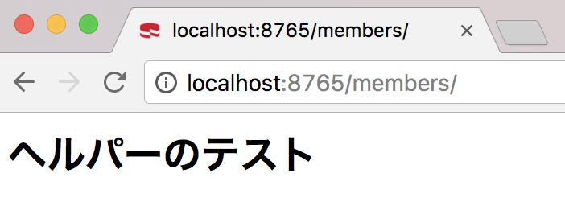
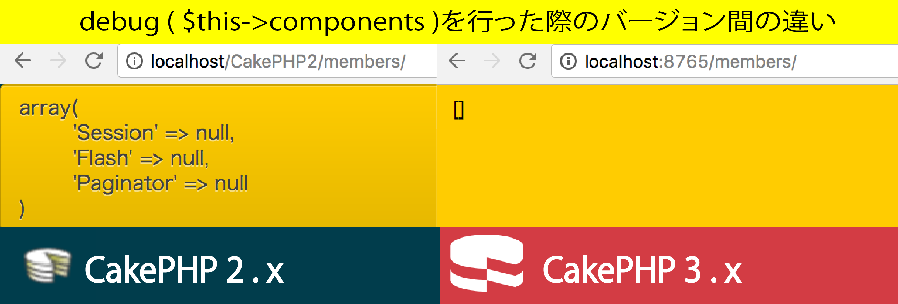
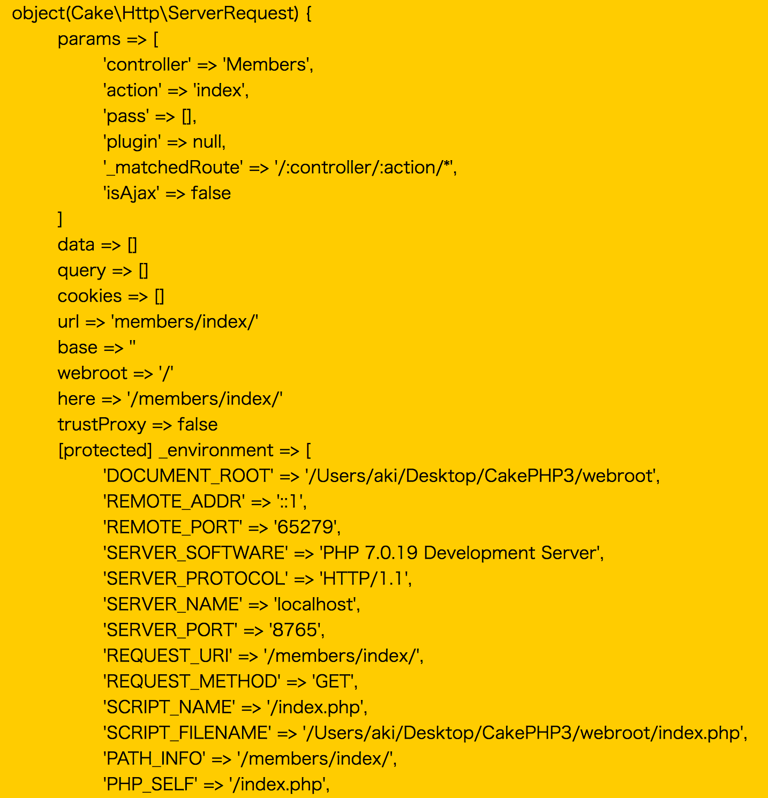

# コントローラのメンバ変数

* コントローラ自体の挙動を指定するためのもの
* コントローラを呼び出すCakePHPの振る舞いを指定する

この値を変更することでシステムの挙動をカスタマイズ可能

[CakePHP2.x](MemberController.php)

* それぞれアクション内で`$this->メンバ変数名`とすることでデフォルトの値にアクセス可能
* `$uses`と`$components`に指定されたクラスには、`自コントローラ`の`メンバー変数`としてアクセスできるようになる
    * 例: Membersコントローラの中で、Meetingsテーブルを使用したい場合は下記

```php
<?php
class MembersController extends AppController {
    
    public $uses = 'Meeting';
    
    public function add() {
        $meetings = $this->Meeting->find('list');
    }
}
```

* `$helpers`に指定されたクラスには、画面ファイル(.ctp)から自クラスのメンバー変数としてアクセスできるようになる

## 2.xと3.xのメンバ変数の差異

### $usesは廃止

* メソッド内でdebug($this->helpers);とすることで、使用しているモデルを表示することができた
    * CakePHP3では、`false(そんな変数はありません`が返る
* 2.xまでは$usesに別テーブルを指定すれば、`$this->別テーブル`の形で呼び出せまた
    * 3.xからはTableRegistryを使用した方法に変更された
* [diffence](difference.php)

## $helpers

```php
public function index()
{
    debug($this->helpers);
}
```

* [例](TestHelper.php)
* [表示](index.cpt)

ヘルパーの作り方は、詳しくは[公式ドキュメント](https://book.cakephp.org/3.0/ja/views/helpers.html)">参照



### $viewはCakePHP3.xでは非推奨

* cptファイルの表示について

```php
public function index() {
    debug($this->view);  // 2.xでは'index'が表示され、3.xではnullが表示される
}
```

* 下記のようにすれば2.xも3.xもメソッド名と異なるctpファイルを表示することができる

```php
// index()は通常index.ctpを表示するが、add.cptを表示するよう指定
public function index() {
    $this->view = 'add';
}
```

* しかし、`CakePHP3.xでは`非推奨``の旨が表示され、別の方法で行うよう促される

```text
Deprecated (16384): Controller::$view is deprecated. Use $this->viewBuilder()->getTemplate() instead. [CORE/src/Controller/Controller.php, line 347]
```

### $component

* CakePHP3.xで[フィールドで宣言する方法](http://qiita.com/frost_star/items/0921da2e4973b637a2b2)もある
* しかし下記のようにloalComponentを使用することもできる

```php
$this->loadComponent('Paginator');
```



### $layoutは非推奨

* CakePHP2.xでは使用しているレイアウトが表示される

```php
public function index() {
    debug($this->layout);exit;        // 2.xでは'default'と表示されるが、3.xではnull
}
```

* しかしCakePHP3.xではnullとなる
* 存在しない変数はfalseが返るので、存在はしている
* レイアウトファイルの指定に関しても別メソッドへ誘導される

```text
Deprecated (16384): Controller::$layout is deprecated. 
```

## $request

* httpリクエスト情報はコントローラのメンバー変数`$this->request`に格納される

```php
// $this->requestの中を表示
debug($this->request);
```



* この情報のうち、例えば、requestのurlの値を表示したいのであれば、アクションの中で下記のようにする

```php
debug($this->request->url);  // この例では'members/' と表示される
```

requestの持つ値のうち、`コントローラ`での使用頻度が高いのは、以下の２つ

* `パラメータ`が格納される`params`
* `FORMデータ`が格納される`data`